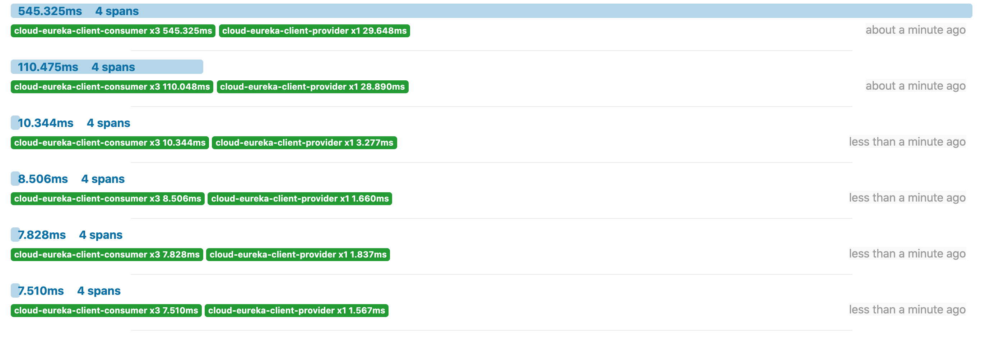

### 分布式请求链路跟踪（Spring Cloud Sleuth）

> sleuth 英[sluːθ]   美[sluːθ]
>
> 是什么？
>
> Spring Cloud Sleuth provides Spring Boot auto-configuration for distributed tracing.
>
> 分布式请求链路跟踪
>
> 就是一个工具，链路跟踪的
>
> 使用它，可以很容易的描述我们请求的全部的过程，可以帮助我们的进行分析分一步的变化以及请求的时间，优化我们的整个的系统

官网：

https://spring.io/projects/spring-cloud-sleuth#overview

https://github.com/spring-cloud/spring-cloud-sleuth

**通常与zipkin网页的形式进行展现我们的请求链路**

**跟踪原理**

分布式系统中的服务跟踪在理论上并不复杂，它主要包括下面两个关键点

为了实现请求跟踪，当请求发送到分布式系统的入口端点时，只需要服务跟踪框架为该请求创建一个唯一的跟踪标识，同时在分布式系统内部流转的时候，框架始终保持传递该唯一标识，直到返回给请求方为止，这个唯一标识就是前文中提到的 Trace ID。通过 Trace ID 的记录，我们就能将所有请求过程的日志关联起来。

为了统计各处理单元的时间延迟，当请求到达各个服务组件时，或是处理逻辑到达某个状态时，也通过一个唯一标识来标记它的开始、具体过程以及结束，该标识就是前文中提到的 Span ID。对于每个 Span 来说，它必须有开始和结東两个节点，通过记录开始 Span 和结束 Span 的时间戳，就能统计出该 Span 的时间延退，除了时间戳记录之外，它还可以包含一些其他元数据，比如事件名称、请求信息等。

### 一、zipkin的搭建过程

下载地址：https://dl.bintray.com/openzipkin/maven/io/zipkin/java/zipkin-server/

运行：

```shell
java -jar -Xms128m -Xmx128m zipkin-server-2.12.9-exec.jar
```


访问：http://127.0.0.1:9411/


看到上面的界面，说明我们的安装是成功的。

### 二、配置环境

#### 2.1 采用的环境

eureka的服务注册中心，以及服务的请求者以及服务的消费者。

#### 2.2 配置测试环境

配置spring-cloud-eureka-client-consumer-80

```xml
<!--
        引入 zipkin 分布式链路跟踪

        包含了sleuth+zipkin
 -->
<dependency>
    <groupId>org.springframework.cloud</groupId>
    <artifactId>spring-cloud-starter-zipkin</artifactId>
</dependency>
```

配置application.yml

```yaml
server:
  port: 80
spring:
  application:
    name: cloud-eureka-client-consumer
  # zipkin 的相关配置
  zipkin:
    base-url: http://localhost:9411/
  sleuth:
    sampler:
      probability: 1 # 采样率 他的值介于 0-1 之间  1表示全部采集 测试环境 采用全部采集

#  cloud:
#    # 配置zookeeper 的地址
#    zookeeper:
#      connect-string: 192.168.31.66:2181
    # consul 的相关配置
#    consul:
#      host: 192.168.31.66
#      port: 8500
eureka:
  instance:
    instance-id: ${spring.application.name}:${server.port}
    prefer-ip-address: true
  client:
    service-url:
      #defaultZone: http://peer1:7001/eureka/,http://peer2:7002/eureka/ # 服务的注册中心 高可用的模式
      defaultZone: http://peer1:7001/eureka/  # 服务的注册中心 单机版模式
    register-with-eureka: true
    fetch-registry: true
# 配置请求的超时时间
ribbon:
  ReadTimeout: 5000
  ConnectTimeout: 5000
feign:
  hystrix:
    enabled: true # 首先在配置文件上开启配置 支持 服务降级
```

相似的配置：

**spring-cloud-eureka-client-provider-8001、spring-cloud-eureka-client-provider-8002**

```xml
<!--
       引入 zipkin 分布式链路跟踪

       包含了sleuth+zipkin
-->
<dependency>
    <groupId>org.springframework.cloud</groupId>
    <artifactId>spring-cloud-starter-zipkin</artifactId>
</dependency>
```

```yaml
server:
  port: 8001 # 配置端口号
eureka:
  client:
    register-with-eureka: true # 是否向注册中心注册自己
    fetch-registry: true # 是否拉去相关配置信息
    service-url:
      #defaultZone: http://peer1:7001/eureka/,http://peer2:7002/eureka/  # 服务的注册中心 高可用的模式
      defaultZone: http://peer1:7001/eureka/  # 服务的注册中心 单机版模式
  instance:
    prefer-ip-address: true # 是否展示真实的自己的IP
    instance-id: ${spring.application.name}:${server.port} # 自己服务的实例的名称
spring:
  application:
    name: cloud-eureka-client-provider # 服务的名称
  zipkin:
    base-url: http://localhost:9411/
  sleuth:
    sampler:
      probability: 1 # 采样率 他的值介于 0-1 之间  1表示全部采集 测试环境 采用全部采集
#  cloud:
#    # 配置zookeeper 的地址
#    zookeeper:
#      connect-string: 192.168.31.66:2181
      # consul 的相关配置
#    consul:
#      host: 192.168.31.66
#      port: 8500
```

#### 2.3 启动项目测试


上面就是我们需要启动的项目


启动的结果如上所示。


访问：http://127.0.0.1//consumer/feign/getServerPort

之后点击查找：


我们可以看到我们的请求




这样我们就可以看到我们的请求的全部过程是如何进行的，哪一步出错或者哪一步需要我们优化的地方。


### 三、代码小结

https://github.com/zhaoligang594/spring-cloud-learn/releases/tag/13.0.0

