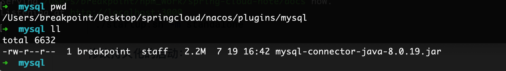
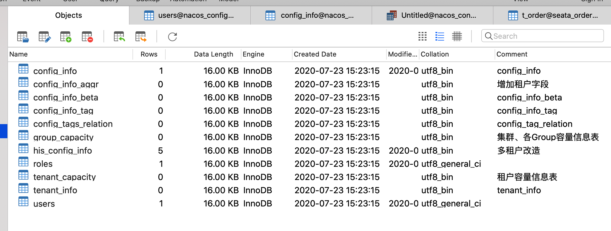
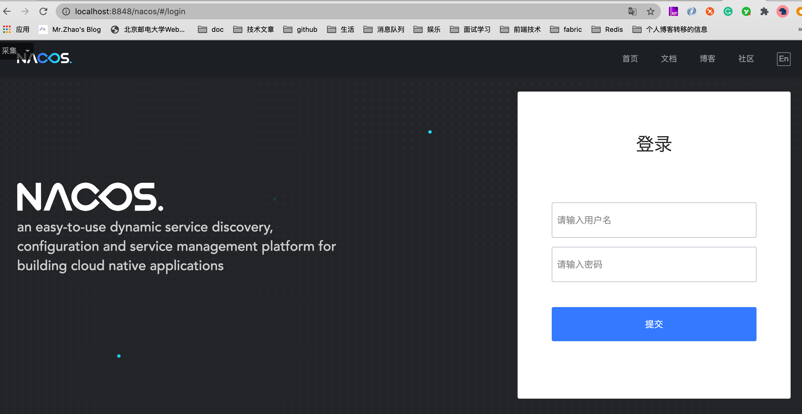
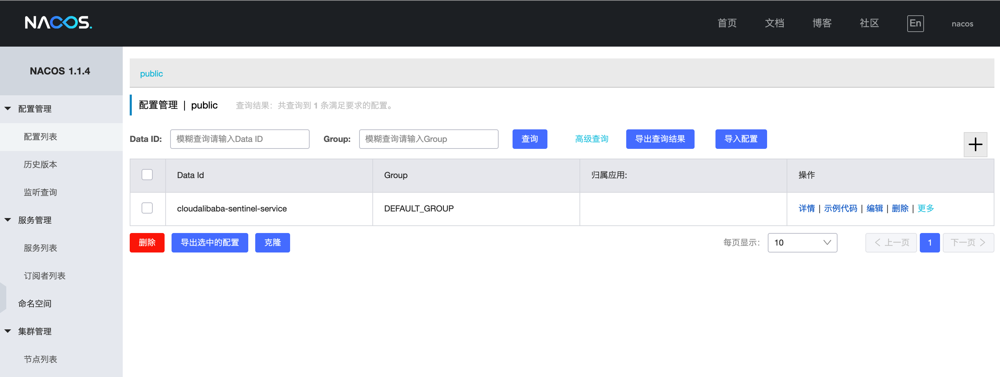
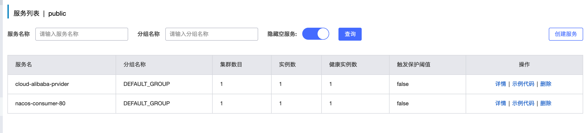
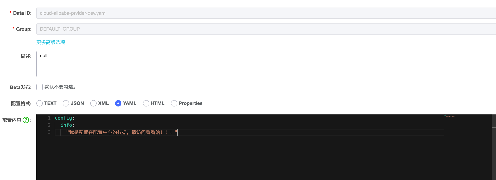
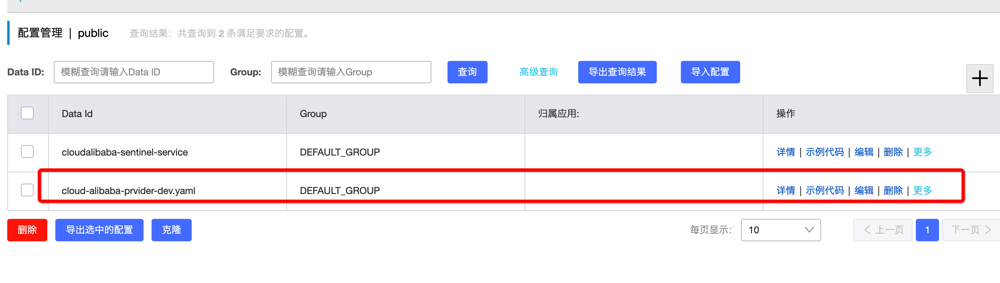
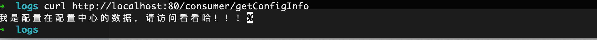
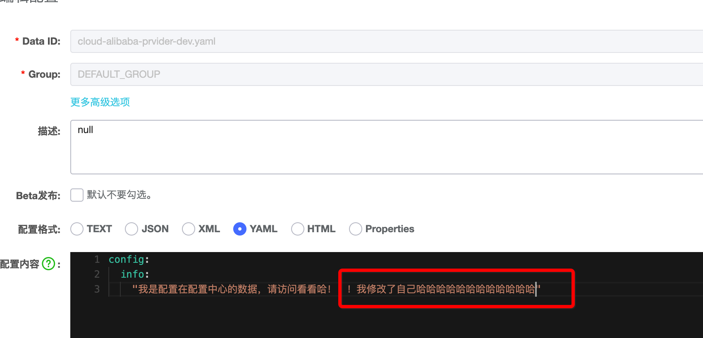
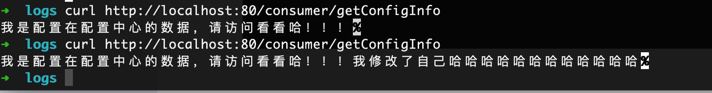

### 一、Spring Cloud Alibab Nacos

> Nacos (official site: [http://nacos.io](http://nacos.io/)) is an easy-to-use platform designed for `dynamic service discovery` and `configuration` and `service management`. It helps you to build `cloud native applications` and `microservices platform` easily.

### 二、Nacos 提供的主要的功能

- **Service Discovery and Service Health Check**

  Nacos makes it simple for services to register themselves and to discover other services via a DNS or HTTP interface. Nacos also provides real-time healthchecks of services to prevent sending requests to unhealthy hosts or service instance.

- **Dynamic Configuration Management**

  Dynamic Configuration Service allows you to manage configurations of all services in a centralized and dynamic manner across all environments. Nacos eliminates the need to redeploy applications and services when configurations are updated, which makes configuration changes more efficient and agile.

- **Dynamic DNS Service**

  Nacos supports weighted routing, making it easier for you to implement mid-tier load balancing, flexible routing policies, flow control, and simple DNS resolution services in the production environment within your data center. It helps you to implement DNS-based service discovery easily and prevent applications from coupling to vendor-specific service discovery APIs.

- **Service and MetaData Management**

  Nacos provides an easy-to-use service dashboard to help you manage your services metadata, configuration, kubernetes DNS, service health and metrics statistics.

### 三、安装Nacos

> 官网：https://nacos.io/zh-cn/
>
> 下载地址：https://github.com/alibaba/nacos/releases
>
> 我现在的版本是1.1.4

#### 3.1 下载软件

https://github.com/alibaba/nacos/releases/download/1.1.4/nacos-server-1.1.4.zip

#### 3.2 安装

**直接启动：**

```shell
./startup.sh -m standalone
```

**修改持久化的启动：**

> nacos的原本的数据存储的方案是存储在derby数据库上。我们可以讲之久化的信息存储在mysql里面，方便与我们的查看。
>
> 1. 如果你的数据库是mysql8,如果不是，直接从第二步开始
>
> 在解压的目录，新建立文件夹：mkdir -p plugins/mysql
>
> 将 mysql-connector-java-8.0.X.jar 复制到该文件下。
>
> 
>
> 2. 创建数据库
>
> 进入根据nacos-mysql.sql 在本地的数据创建一个名字叫做nacos_config，并且执行给我们的脚本。
>
> 
>
> 3. 修改配置文件：application.properties
>
> 在文件的最后加上这样的配置。
>
> ```properties
> #####################################
> spring.datasource.platform=mysql
> 
> db.num=1
> db.url.0=jdbc:mysql://127.0.0.1:3306/nacos_config?characterEncoding=utf8&connectTimeout=1000&socketTimeout=3000&autoReconnect=true&useSSl=false&useUnicode=true
> db.user=root
> db.password=XXXX
> ```
>
> 4. 经过上面的配置，我们就可以启动啦
>
> ```
> ./startup.sh -m standalone
> ```
>
> 5. 访问测试：http://localhost:8848/nacos



得到上面的界面，说明nacos安装成功啦。

登陆试试：nacos/nacos



### 四、Nacos的功能

nacos=eureka+config+bus

替代eureka作为服务的注册中

替代config作为服务的配置中心

于此同时：nacos是支持AP和CP的模式的，撒撒

### 五、服务注册中心的应用

> Nacos is an easy-to-use dynamic service discovery, configuration and service management platform for building cloud native applications.
>
> With Spring Cloud Alibaba Nacos Discovery, you can quickly access the Nacos service registration feature based on Spring Cloud’s programming model.
>
> Service discovery is one of the key components in the microservices architecture. In such a architecture, configuring a service list for every client manually could be a daunting task, and makes dynamic scaling extremely difficult. Nacos Discovery helps you to register your service to the Nacos server automatically, and the Nacos server keeps track of the services and refreshes the service list dynamically. In addition, Nacos Discovery registers some of the metadata of the service instance, such as host, port, health check URL, homepage to Nacos. For details about how to download and start Nacos, refer to the [Nacos Website](https://nacos.io/zh-cn/docs/quick-start.html).

#### 5.1 创建服务的生产者

**新建立项目**

spring-cloud-alibaba-provider8001

**项目配置--pom.xml**

```xml
<?xml version="1.0" encoding="UTF-8"?>
<project xmlns="http://maven.apache.org/POM/4.0.0"
         xmlns:xsi="http://www.w3.org/2001/XMLSchema-instance"
         xsi:schemaLocation="http://maven.apache.org/POM/4.0.0 
         http://maven.apache.org/xsd/maven-4.0.0.xsd">
    <parent>
        <artifactId>spring-cloud-learn</artifactId>
        <groupId>com.breakpoint</groupId>
        <version>1.0-SNAPSHOT</version>
    </parent>
    <modelVersion>4.0.0</modelVersion>
    <packaging>jar</packaging>

    <artifactId>spring-cloud-alibaba-provider8001</artifactId>

    <dependencies>
        <!--  nacos-discovery 服务发现    -->
        <dependency>
            <groupId>com.alibaba.cloud</groupId>
            <artifactId>spring-cloud-starter-alibaba-nacos-discovery</artifactId>
        </dependency>
        <!--  nacos-config 服务配置   -->
        <dependency>
            <groupId>com.alibaba.cloud</groupId>
            <artifactId>spring-cloud-starter-alibaba-nacos-config</artifactId>
        </dependency>
        <!--   引入spring-boot支持的依赖  -->
        <dependency>
            <groupId>org.springframework.boot</groupId>
            <artifactId>spring-boot-starter-web</artifactId>
        </dependency>
        <!--  注意一下 要引入 starter 的  -->
        <dependency>
            <groupId>org.springframework.boot</groupId>
            <artifactId>spring-boot-starter-actuator</artifactId>
        </dependency>
        <dependency>
            <groupId>org.springframework.boot</groupId>
            <artifactId>spring-boot-devtools</artifactId>
            <scope>runtime</scope>
            <optional>true</optional>
        </dependency>
        <dependency>
            <groupId>org.projectlombok</groupId>
            <artifactId>lombok</artifactId>
        </dependency>
        <dependency>
            <groupId>org.springframework.boot</groupId>
            <artifactId>spring-boot-starter-test</artifactId>
            <scope>test</scope>
        </dependency>
    </dependencies>

</project>
```

**项目配置--application.yml**

```yaml
spring:
  profiles:
    active: dev # 当前的环境
```

**项目配置--bootstrap.yml**

```yaml
server:
  port: 8001
spring:
  application:
    name: cloud-alibaba-prvider # 服务的名称
  cloud:
    nacos:
      discovery:
        server-addr: 127.0.0.1:8848 # 服务的地址
        enabled: true # 是否惊醒服务注册与发现
      config:
        server-addr:  127.0.0.1:8848 # 服务的地址
        file-extension: yaml
management:
  endpoints:
    web:
      exposure:
        include: "*"
config:
  info: "这是从服务提供者nacos的配置的信息 ${spring.application.name}:${server.port}"
```

**项目配置--启动类**

```java
/**
 * @author :breakpoint/赵立刚
 * @date : 2020/07/28
 */
@SpringBootApplication
@EnableDiscoveryClient
public class NacosProvider8001 {
    public static void main(String[] args) {
        SpringApplication.run(NacosProvider8001.class, args);
    }
}
```

**项目配置--业务类**

```java
/**
 * @author :breakpoint/赵立刚
 * @date : 2020/07/28
 */
@Slf4j
@RefreshScope
@RestController
public class NacosController {

    @Value("${config.info}")
    private String configInfo;

    @GetMapping("/getConfigInfo")
    public String getConfigInfo() {
        return configInfo;
    }

}
```

#### 5.2 创建服务的消费者

> 大致的步骤与上面的类似！
>
> spring-cloud-alibaba-consumer80

**项目配置--pom.xml**

```xml
<?xml version="1.0" encoding="UTF-8"?>
<project xmlns="http://maven.apache.org/POM/4.0.0"
         xmlns:xsi="http://www.w3.org/2001/XMLSchema-instance"
         xsi:schemaLocation="http://maven.apache.org/POM/4.0.0 
         http://maven.apache.org/xsd/maven-4.0.0.xsd">
    <parent>
        <artifactId>spring-cloud-learn</artifactId>
        <groupId>com.breakpoint</groupId>
        <version>1.0-SNAPSHOT</version>
    </parent>
    <modelVersion>4.0.0</modelVersion>
    <packaging>jar</packaging>
    <artifactId>spring-cloud-alibaba-consumer80</artifactId>

    <dependencies>
        <!--  nacos-discovery 服务发现    -->
        <dependency>
            <groupId>com.alibaba.cloud</groupId>
            <artifactId>spring-cloud-starter-alibaba-nacos-discovery</artifactId>
        </dependency>
        <!--  openfeign 依赖  -->
        <dependency>
            <groupId>org.springframework.cloud</groupId>
            <artifactId>spring-cloud-starter-openfeign</artifactId>
        </dependency>
        <!--   引入spring-boot支持的依赖  -->
        <dependency>
            <groupId>org.springframework.boot</groupId>
            <artifactId>spring-boot-starter-web</artifactId>
        </dependency>
        <!--  注意一下 要引入 starter 的  -->
        <dependency>
            <groupId>org.springframework.boot</groupId>
            <artifactId>spring-boot-starter-actuator</artifactId>
        </dependency>
        <dependency>
            <groupId>org.springframework.boot</groupId>
            <artifactId>spring-boot-devtools</artifactId>
            <scope>runtime</scope>
            <optional>true</optional>
        </dependency>
        <dependency>
            <groupId>org.projectlombok</groupId>
            <artifactId>lombok</artifactId>
        </dependency>
        <dependency>
            <groupId>org.springframework.boot</groupId>
            <artifactId>spring-boot-starter-test</artifactId>
            <scope>test</scope>
        </dependency>
    </dependencies>
</project>
```

**项目配置--application.yml**

```yaml
server:
  port: 80 # 项目的端口号
spring:
  application:
    name: nacos-consumer-80
  cloud:
    nacos:
      discovery:
        enabled: true # 是否启用服务注册与发现
        server-addr: 127.0.0.1:8848 # 服务的注册地址
management:
  endpoints:
    web:
      exposure:
        include: "*"
```

**项目配置--启动类**

```java
/**
 * @author :breakpoint/赵立刚
 * @date : 2020/07/28
 */
@SpringBootApplication
@EnableDiscoveryClient
@EnableFeignClients
public class NacosConsumer80 {
    public static void main(String[] args) {
        SpringApplication.run(NacosConsumer80.class, args);
    }
}
```

**项目配置--feign**

```java
/**
 * @author :breakpoint/赵立刚
 * @date : 2020/07/28
 */
@FeignClient(value = "cloud-alibaba-prvider")
public interface NacosService {

    @GetMapping("/getConfigInfo")
    public String getConfigInfo();

}
```

**项目配置--service**

```java
/**
 * @author :breakpoint/赵立刚
 * @date : 2020/07/28
 */
@RestController
public class NacosConsumerController {

    @Autowired
    private NacosService nacosService;

    @GetMapping("/consumer/getConfigInfo")
    public String getConfigInfo() {
        return nacosService.getConfigInfo();
    }


}
```

#### 5.3 运行测试

> 分别启动服务的提供者以及服务的消费者。登陆nacos查看结果。



上面的测试说明，我们自己创建的服务已经可以进行服务的注册以及发现了。

#### 5.4 调用测试


成功调用并且返回结果。

更多的配置：https://github.com/alibaba/spring-cloud-alibaba/blob/master/spring-cloud-alibaba-docs/src/main/asciidoc/nacos-discovery.adoc

### 六、服务配置中心

文档地址：https://github.com/alibaba/spring-cloud-alibaba/blob/master/spring-cloud-alibaba-docs/src/main/asciidoc/nacos-config.adoc

> 配置的文件名的要求：
>
> When configurations are loaded by Nacos Config, basic configurations with DataId of `${spring.application.name}. ${file-extension:properties}` , and DataId of `${spring.application.name}-${profile}. ${file-extension:properties}` are also loaded. If you need to use different configurations from different environments, you can use the `${spring.profiles.active}` configuration provided by Spring.

根据上面的要求，我们知道，我们需要配置的文件名是cloud-alibaba-prvider-dev.yaml






修改本地的配置：

```yaml
server:
  port: 8001
spring:
  application:
    name: cloud-alibaba-prvider # 服务的名称
  cloud:
    nacos:
      # 服务注册与发现的配置信息
      discovery:
        server-addr: 127.0.0.1:8848 # 服务的地址
        enabled: true # 是否惊醒服务注册与发现
        service: ${spring.application.name} # 服务的名字 默认  ${spring.application.name}
      # 服务配置的配置信息
      config:
        server-addr:  127.0.0.1:8848 # 服务的地址
        file-extension: yaml
        prefix: ${spring.application.name} # 默认 ${spring.application.name}
        # cloud-alibaba-prvider-dev.yaml
management:
  endpoints:
    web:
      exposure:
        include: "*"
        
# 这个地方已经被注释掉了 配置的信息 从 nacos里面取
#config:
#  info: "这是从服务提供者nacos的配置的信息 ${spring.application.name}:${server.port}"
```

**测试：**

```shell
curl http://localhost:80/consumer/getConfigInfo
```



### 七、消息总线

> nacos也是具有消息总线的功能，我们在配置的变化的时候，会自动的更新我们服务中的配置。

#### 7.1 前提条件

**在更新的组件上加上@RefreshScope**

```java
@Slf4j
@RefreshScope // 支持这个组件进行更新他自己的属性
@RestController
public class NacosController {

    @Value("${config.info}")
    private String configInfo;

    @GetMapping("/getConfigInfo")
    public String getConfigInfo() {
        return configInfo;
    }

}
```

#### 7.2 测试

修改一下：



测试：



> 这里足以可以观察到我们的期望的结果。

代码小结：https://github.com/zhaoligang594/spring-cloud-learn/releases/tag/9.0.0

---


