### Sentinel(分布式系统的流量防卫兵)


> 官网：
>
> https://spring-cloud-alibaba-group.github.io/github-pages/hoxton/en-us/index.html#_spring_cloud_alibaba_sentinel
>
> https://github.com/alibaba/Sentinel
>
> https://github.com/alibaba/Sentinel/wiki/%E4%BB%8B%E7%BB%8D
>
> https://github.com/alibaba/spring-cloud-alibaba/wiki/Sentinel
>
> [https://github.com/alibaba/Sentinel/wiki/%E4%BB%8B%E7%BB%8D](https://github.com/alibaba/Sentinel/wiki/介绍)

简介：

随着微服务的流行，服务和服务之间的稳定性变得越来越重要。Sentinel 以流量为切入点，从流量控制、熔断降级、系统负载保护等多个维度保护服务的稳定性。

Sentinel 具有以下特征:

- **丰富的应用场景**：Sentinel 承接了阿里巴巴近 10 年的双十一大促流量的核心场景，例如秒杀（即突发流量控制在系统容量可以承受的范围）、消息削峰填谷、集群流量控制、实时熔断下游不可用应用等。
- **完备的实时监控**：Sentinel 同时提供实时的监控功能。您可以在控制台中看到接入应用的单台机器秒级数据，甚至 500 台以下规模的集群的汇总运行情况。
- **广泛的开源生态**：Sentinel 提供开箱即用的与其它开源框架/库的整合模块，例如与 Spring Cloud、Dubbo、gRPC 的整合。您只需要引入相应的依赖并进行简单的配置即可快速地接入 Sentinel。
- **完善的 SPI 扩展点**：Sentinel 提供简单易用、完善的 SPI 扩展接口。您可以通过实现扩展接口来快速地定制逻辑。例如定制规则管理、适配动态数据源等。

Sentinel 的主要特性：


Sentinel 的开源生态：


Sentinel 分为两个部分:

- 核心库（Java 客户端）不依赖任何框架/库，能够运行于所有 Java 运行时环境，同时对 Dubbo / Spring Cloud 等框架也有较好的支持。
- 控制台（Dashboard）基于 Spring Boot 开发，打包后可以直接运行，不需要额外的 Tomcat 等应用容器。

### 一、官网以及其他信息

下载地址：https://github.com/alibaba/Sentinel/releases

我下载的是https://github.com/alibaba/Sentinel/releases/download/1.7.0/sentinel-dashboard-1.7.0.jar这个版本。

之后运行安装，用下面的命令：

```shell
java -jar -Xms128m -Xmx128m -Dserver.port=8080 sentinel-dashboard-1.7.0.jar
```

安装完成之后，访问http://localhost:8080/出现下面的界面，表示我们安装是成功的。


用户名/密码：sentinel/sentinel进行登陆

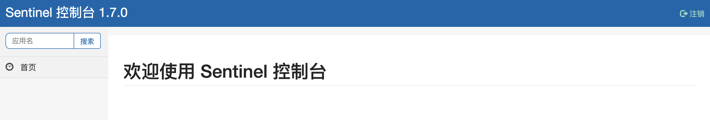


接下来就到了配置我们的项目步骤！

### 二、项目代码的修改以及测试

#### 2.1 项目代码的修改

**修改我们的项目spring-cloud-alibaba-provider8001**

**pom.xml**

```xml
<!--   sentinel-datasource-nacos 后面的持久化会用到的  -->
<!--
        持久化的用到的地方
 -->
<dependency>
    <groupId>com.alibaba.csp</groupId>
    <artifactId>sentinel-datasource-nacos</artifactId>
</dependency>

<!--   spring-cloud-starter-alibaba-sentinel  -->

<dependency>
    <groupId>com.alibaba.cloud</groupId>
    <artifactId>spring-cloud-starter-alibaba-sentinel</artifactId>
</dependency>
```

**bootstrap.yml**

```yaml
server:
  port: 8001
spring:
  application:
    name: cloud-alibaba-prvider # 服务的名称
  cloud:
    nacos:
      # 服务注册与发现的配置信息
      discovery:
        server-addr: 127.0.0.1:8848 # 服务的地址
        #enabled: true # 是否进行服务注册与发现
        #service: ${spring.application.name} # 服务的名字 默认  ${spring.application.name}
      # 服务配置的配置信息
      config:
        server-addr:  127.0.0.1:8848 # 服务的地址
        file-extension: yaml
        #prefix: client # 默认 ${spring.application.name}
            # cloud-alibaba-prvider-dev.yaml
    # 修改的地方 加上我们的sentinel的配置
    sentinel:
      transport:
        dashboard: 127.0.0.1:8080 # 配置sentinel的 dashboard 的地址
        port: 8791 # 默认的端口是 8791 如果被占用 将会进行 +1 的扫描的操作，直至找到没有占用的端口
management:
  endpoints:
    web:
      exposure:
        include: "*"
#config:
#  info: "这是从服务提供者nacos的配置的信息 ${spring.application.name}:${server.port}"
```

#### 2.2 请求测试

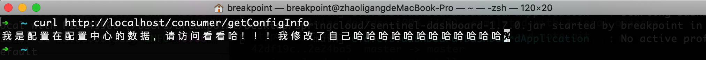

#### 2.3 查看sentinel的控制台

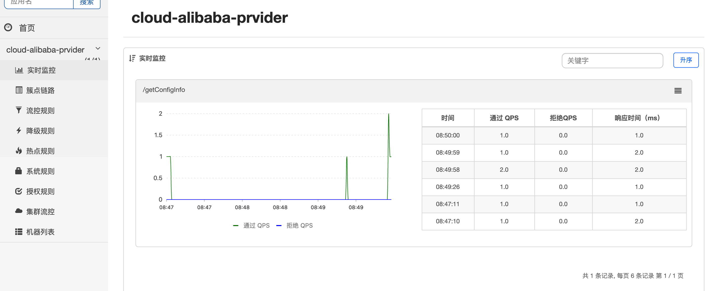

如上面的所示，出现了我们访问的记录以及其他的信息。

> 我们sentinel的功能很多，这里举一个例子。其他的配置请看https://github.com/alibaba/Sentinel/wiki/查看相关的配置。

#### 2.4 配置访问的限流

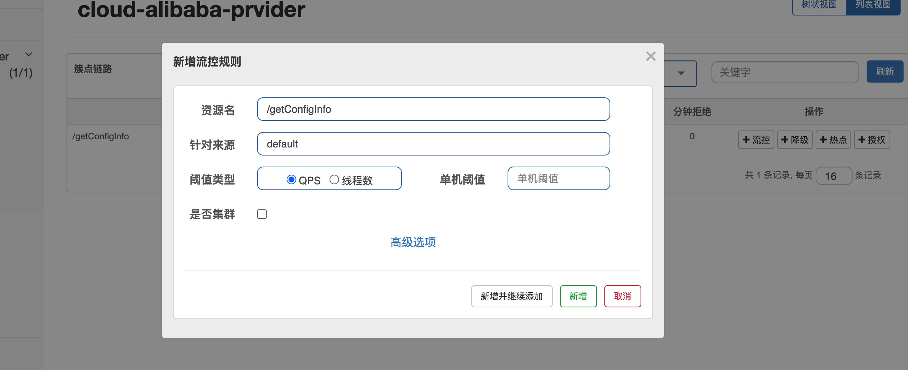

找到我们的配置，进行流控的配置：

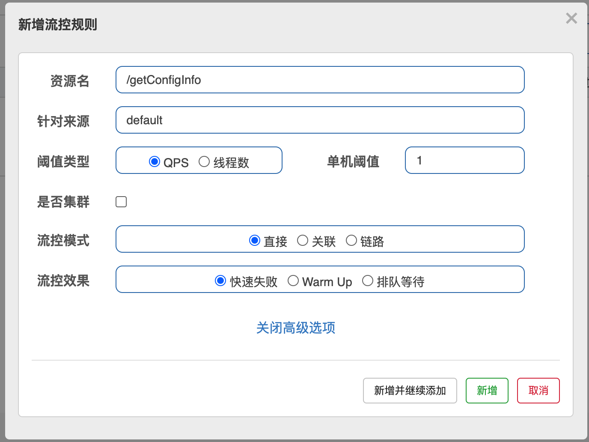

配置成访问的限流问1 req/s;

配置完成的展示

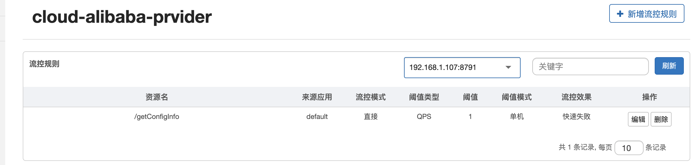

#### 2.5 请求测试

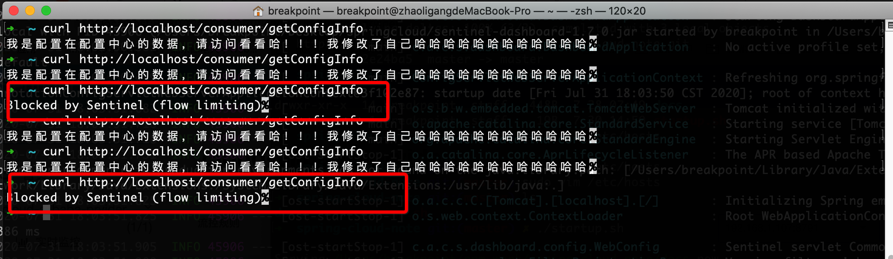

> 根据上面的图片信息，我们发现，在1s内，当请求数量超过1次的时候，就会返回给我们Blocked by Sentinel (flow limiting)这样的信息。说明我们的配置是生效的。

### 三、自定义的错误信息返回

> 上面的说的，返回的信息是Blocked by Sentinel (flow limiting)这样的信息，但是，有的时候，我们不想返回这样的自带的信息，那么这个时候，如何处理呢？

#### 3.1 修改代码

```java
@Slf4j
@RefreshScope
@RestController
public class NacosController {
    @Value("${config.info}")
    private String configInfo;
    @SentinelResource(value = "getConfigInfo", blockHandler = "my_blockHandler")
    @GetMapping("/getConfigInfo")
    public String getConfigInfo() {
        return configInfo;
    }
    // 限流返回的方法
    public String my_blockHandler(BlockException blockException) {
        
        return "你好，我是自定义的返回    "+ configInfo;
    }
}
```

#### 3.2 测试

首先我们发现，以前我们定义的限流规则没有了，是说明，我们的规则没有进行持久化的操作，后续的话，还是要进行之久化的。

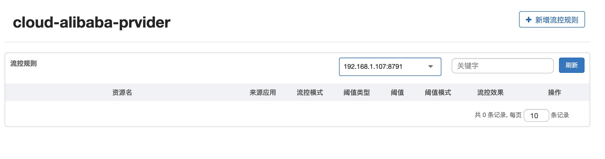

新增我们的配置：

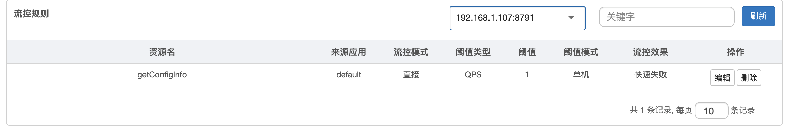

访问测试：

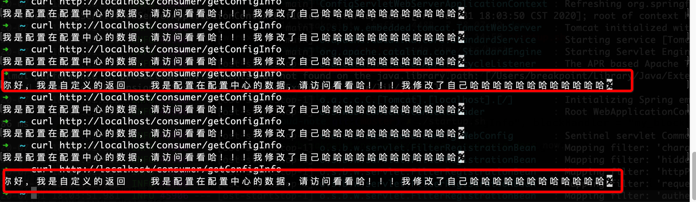

红色的部分就是我们的自定义的返回操作。

#### 3.3 发生异常的时候，我们的自定义的测试会有效果吗？

> 答案是我们应当配置对应的策略，而且在@SentinelResource注解里面也有String fallback()这个属性，配置我们当放生错误的时候，应当如何的处理我们的业务的问题，如何进行降级的操作。

### 四、持久化的问题

> 正如前面的测试，我们从新启动我们的服务，就会出现，我们配置的限流的规则以及其他的配置出现消失的问题。这个时候，我们就应当考虑持久化的问题了。
>
> 当前，我们使用的持久化采用的是nacos辅助我们进行持久话的操作。

```xml
<dependency>
    <groupId>com.alibaba.csp</groupId>
    <artifactId>sentinel-datasource-nacos</artifactId>
</dependency>
```

这个依赖就是负责我们持久化的操作的。

首先登陆一下我们的nacos:

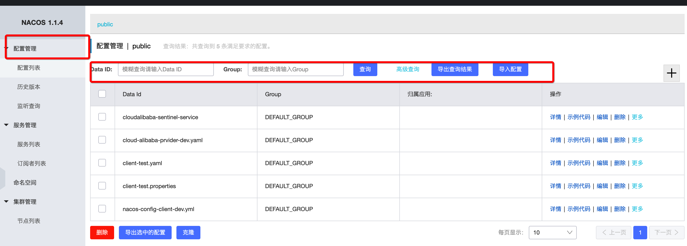

上面的配置管理也可以配置我们的限流规则。

#### 4.1 修改我们的项目

**bootstrap.yml**

```yaml
server:
  port: 8001
spring:
  application:
    name: cloud-alibaba-prvider # 服务的名称
  cloud:
    nacos:
      # 服务注册与发现的配置信息
      discovery:
        server-addr: 127.0.0.1:8848 # 服务的地址
        #enabled: true # 是否进行服务注册与发现
        #service: ${spring.application.name} # 服务的名字 默认  ${spring.application.name}
      # 服务配置的配置信息
      config:
        server-addr:  127.0.0.1:8848 # 服务的地址
        file-extension: yaml
        #prefix: client # 默认 ${spring.application.name}
            # cloud-alibaba-prvider-dev.yaml
    sentinel:
      transport:
        dashboard: 127.0.0.1:8080 # 配置sentinel的 dashboard 的地址
        port: 8791 # 默认的端口是 8791 如果被占用 将会进行 +1 的扫描的操作，直至找到没有占用的端口
      # 增加数据源的配置
      datasource:
        ds1:
          nacos:
           server-addr: 127.0.0.1:8848
           dataId: cloud-alibaba-prvider
           groupId: DEFAULT_GROUP
           data-type: json
           rule-type: flow
management:
  endpoints:
    web:
      exposure:
        include: "*"
#config:
#  info: "这是从服务提供者nacos的配置的信息 ${spring.application.name}:${server.port}"
```

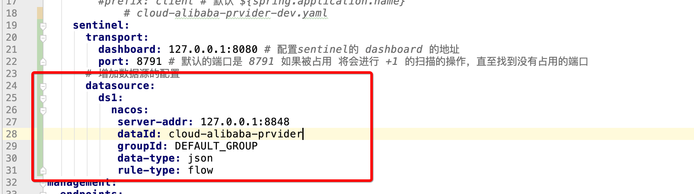

上面的截图是我们修改的地方：

创建我们的新的配置：

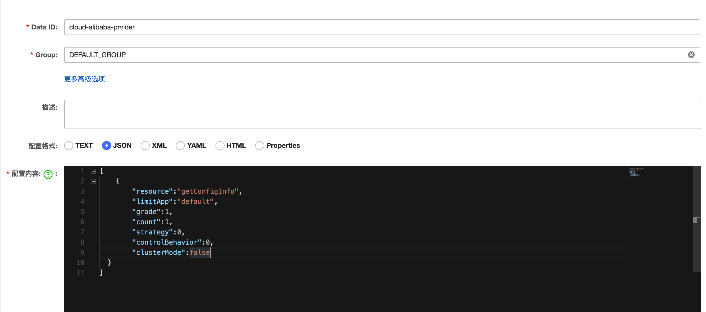

里面的配置信息：

```json
[
	{
			"resource":"getConfigInfo",
			"limitApp":"default",
      "grade":1,
      "count":1,
      "strategy":0,
      "controlBehavior":0,
      "clusterMode":false
  }
]
```


上面是我们的配置的信息。

#### 4.2 测试

重新启动我们的项目。spring-cloud-alibaba-provider8001

直接查看是没有的：

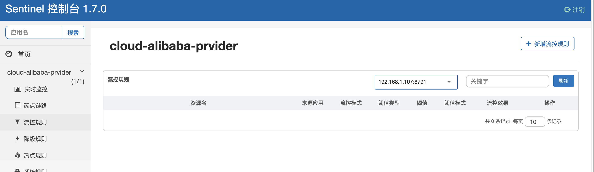

访问几次看看。

发现我们的流控规则出现了

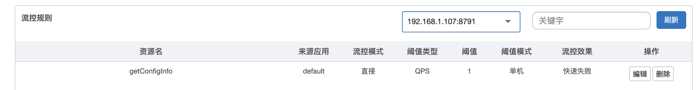

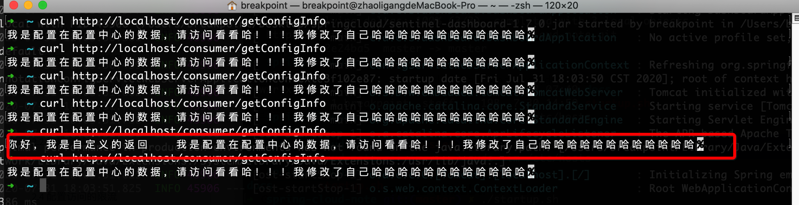

经过上面的测试，当然，我们的规则也是生效的，说明我们的持久化是配置成功的。

---

代码小结：https://github.com/zhaoligang594/spring-cloud-learn/releases/tag/12.0.0


