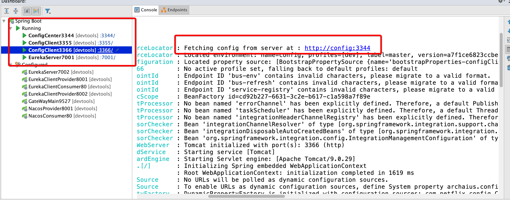
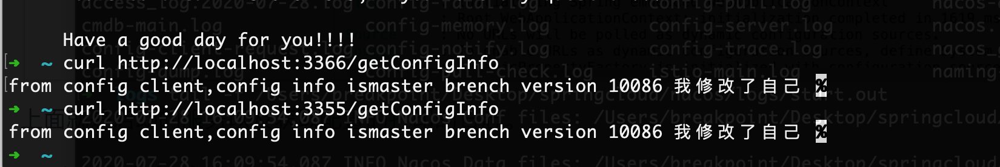
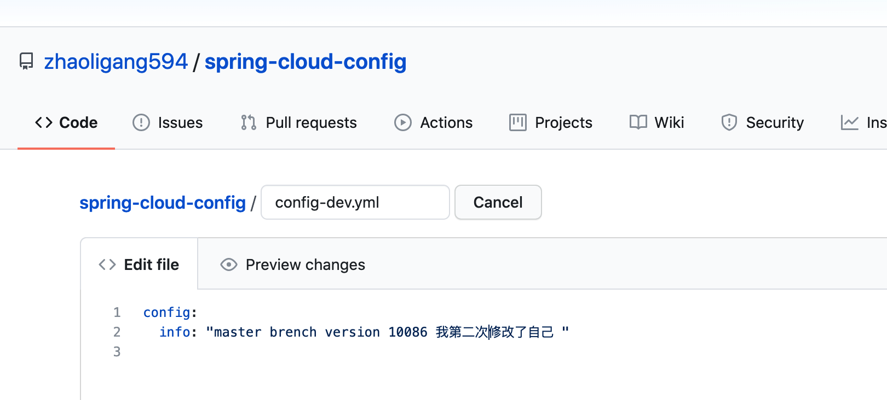
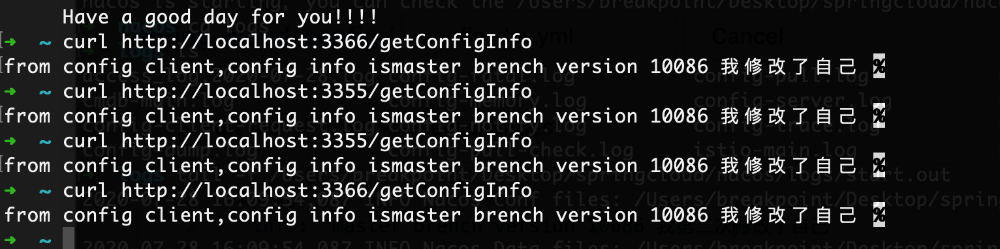
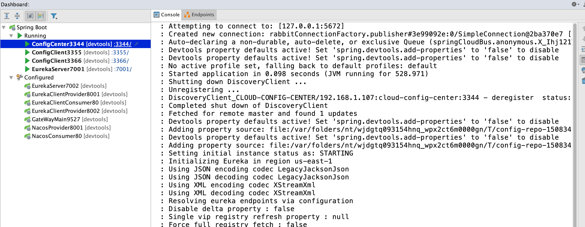
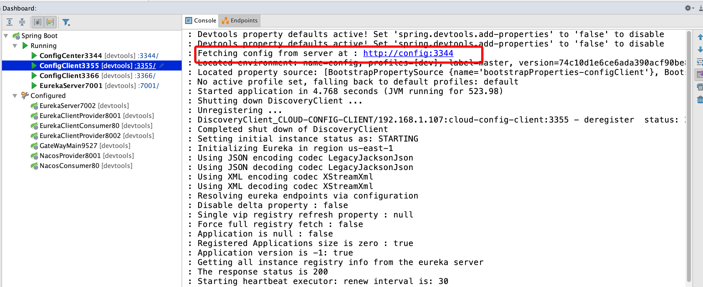
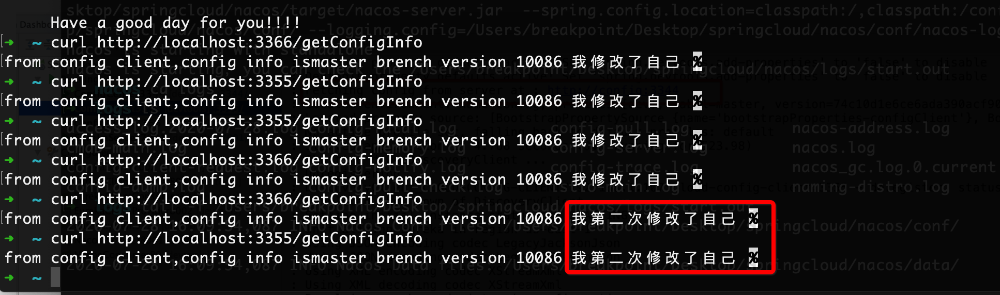
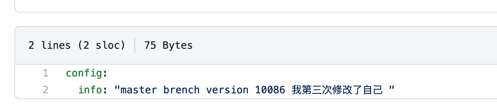
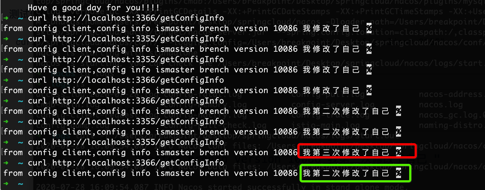
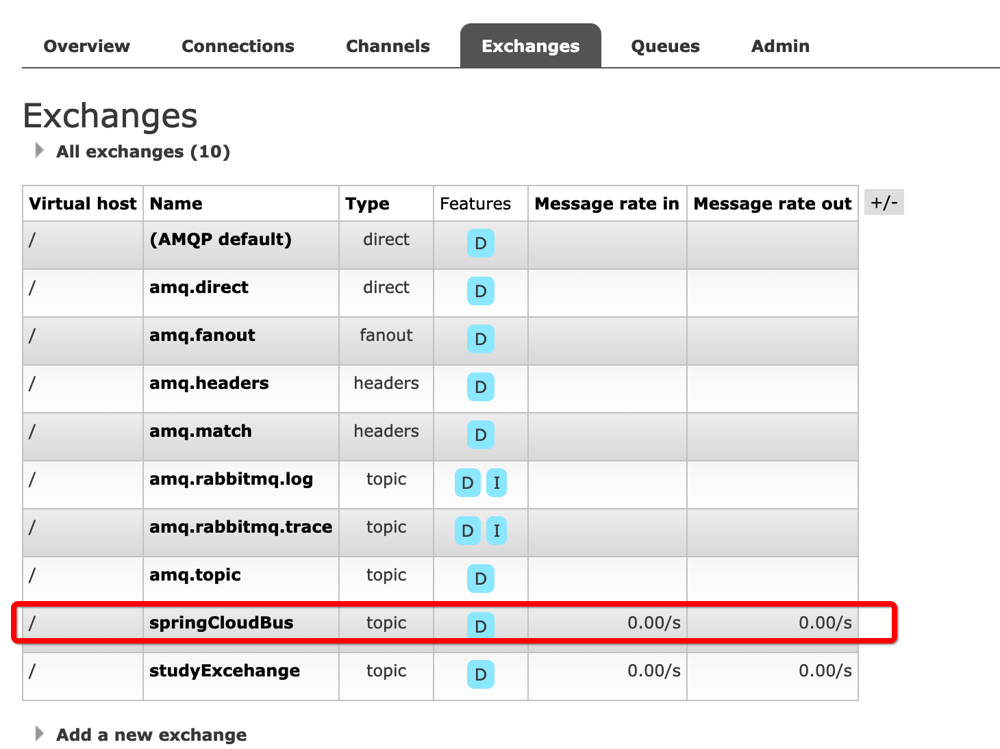

### 服务总线（消息总线）

> 在微服务架构系统中，我们通常会使用轻量级的消息代理来构建一个公用的消息主题让系统中所有的微服务的实例都连接上来，由于该主题产生的消息会被所有的实例监听和消费，所以我们称他们为消息总线。在总线上的各各实例都可以方便的广播一些需要让其他的链接该主题的实例都知道，例如配置信息变更或者其他一些管理操作等。
>
> 由于消息总线在微服务的架构系统中被广泛的使用，所以他同配置中心一样，几乎是微服务架构中的`必备的组件`。

简介：

Spring Cloud Bus links the nodes of a distributed system with a lightweight message broker. This broker can then be used to broadcast state changes (such as configuration changes) or other management instructions. A key idea is that the bus is like a distributed actuator for a Spring Boot application that is scaled out. However, it can also be used as a communication channel between apps. This project provides starters for either an AMQP broker or Kafka as the transport.

翻译：

Spring Cloud Bus用轻量级消息代理连接分布式系统的节点。然后可以使用此代理广播状态更改(如`配置更改`)或其他`管理指令`。一个关键的想法是，总线就像一个扩展的Spring引导应用程序的分布式执行器。不过，它也可以用作应用程序之间的通信通道。该项目为`AMQP代理`或`Kafka`提供启动器作为运输工具。

### 一、测试消息总线

#### 1.1 修改服务配置中心

**spring-cloud-config-config3344**

**pom.xml**

```xml
<dependency>
    <groupId>org.springframework.cloud</groupId>
    <artifactId>spring-cloud-starter-bus-amqp</artifactId>
</dependency>
```

**application.yml**

```yaml
server:
  port: 3344
spring:
  application:
    name: cloud-config-center # 注册进eureka的服务的名字
  cloud:
    config:
      label: master # 分支的名称
      server:
        git:
          uri: https://github.com/zhaoligang594/spring-cloud-config.git
          search-paths:
            - spring-cloud-config # 搜索的文件夹
  # 配置rabbit mq
  rabbitmq:
    host: 127.0.0.1
    port: 5672
    username: guest
    password: guest
# 服务的注册地址
eureka:
  client:
    register-with-eureka: true
    fetch-registry: true
    service-url:
      defaultZone: http://peer1:7001/eureka/
# 配置消息总线的配置相关的配置
management:
  endpoints:
    web:
      exposure:
        include: "bus-refresh"
```

**spring-cloud-config-client-3355**

**pom.xml**

```xml
<!--  添加消息总线的支持   -->
<dependency>
    <groupId>org.springframework.cloud</groupId>
    <artifactId>spring-cloud-starter-bus-amqp</artifactId>
</dependency>
```

**boostrap.yml**

```yaml
server:
  port: 3355
spring:
  application:
    name: cloud-config-client
  cloud:
  	# 配置中心地址以及相关信息
    config:
      label: master  # label
      name: config   # name
      profile: dev   # 哪一个
      uri: http://config:3344 # 合在一起：http://config:3344/master/config-dev.yml
  # 消息中间件的配置
  rabbitmq:
    host: 127.0.0.1
    port: 5672
    username: guest
    password: guest
# eureka的服务注册地址
eureka:
  client:
    service-url:
      defaultZone: http://peer1:7001/eureka/
# 下面属于动态刷新的部分
management:
  endpoints:
    web:
      exposure:
        include: "*"
# 之后配合 @RefreshScope
#用 curl -X POST "http://localhost:3355/actuator/refresh" 手动进行刷新
```

**新建 spring-cloud-config-client-3366 模块**

> 同样的方法创建spring-cloud-config-client-3366

### 二、启动测试

#### 2.1 启动顺序

eureka服务注册中心----剩余的几个微服务提供者



上面就是启动的服务以及获取配置的打印的日志。

#### 2.2 测试消息总线

> 在这里，消息总线的用途在于通知所有的服务进行更新自己的属性。

**首先访问2个客户端**



```shell
curl http://localhost:3366/getConfigInfo
curl http://localhost:3355/getConfigInfo
```

> 通过上面的访问，我们发现，我们已经成功的将配置的信息从配置中心拿到了本地，而且正常的返回给我们。

**修改我们的配置**




**保存提交、再次进行测试**



> 直接访问，发现，配置的属性事没有发生变化的。

**通知所有服务自动更新配置**

```shell
curl -X POST "http://localhost:3344/actuator/bus-refresh"
```

**查看日志变化**









> 我们看到修改了配置信息。

### 三、定向的更新服务的配置信息

指定某一个实例生效而不是全部

公式：curl -X POST "http://localhost:配置中心的端口号/actuator/bus-refresh/{destination}"

**{destination}==${spring.application.name}:${server.port}**

/bus/refresh发送到具体的实例上

**测试仅仅更新3355**

```
curl -X POST "http://localhost:3344/actuator/bus-refresh/cloud-config-client:3355"
```




执行：

```
curl -X POST "http://localhost:3344/actuator/bus-refresh/cloud-config-client:3355"
```



> 根据结果，我们可以知道，我们想要达到的更新效果达到了。



代码小结：https://github.com/zhaoligang594/spring-cloud-learn/releases/tag/10.0.0

---

**{docsify-updated}** 