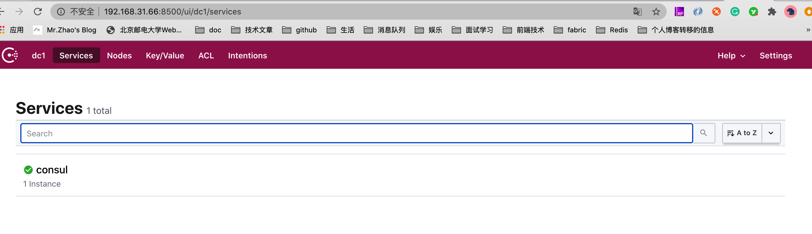
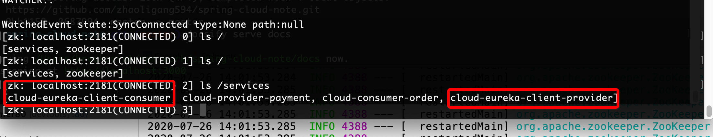

### 零、服务注册中心简介（服务治理）

> 服务的注册中心，顾名思义，就是管理我们的微服务的中心，动态的查看每一个微服务的状态，进行有效的管理。
>
> 与服务注册中心有关的三大角色：`服务提供者`、`服务消费者`、`服务注册中心`。

`服务提供者`、`服务消费者`、`服务注册中心`

它们之间的关系大致如下：

1. 各个微服务在启动时，将自己的网络地址等信息注册到注册中心，注册中心存储这些数据。
2. 服务消费者从注册中心查询服务提供者的地址，并通过该地址调用服务提供者的接口。
3. 各个微服务与注册中心使用一定机制（例如心跳）通信。如果注册中心与某微服务长时间无法通信，就会注销该实例。
4. 微服务网络地址发送变化（例如实例增加或IP变动等）时，会重新注册到注册中心。这样，服务消费者就无需人工修改提供者的网络地址了。

**服务注册中心的功能：**

服务注册表
> 服务注册表是注册中心的核心，它用来记录各个微服务的信息，例如微服务的名称、IP、端口等。服务注册表提供查询API和管理API，查询API用于查询可用的微服务实例，管理API用于服务的注册与注销。

服务注册与发现

> 服务注册是指微服务在启动时，将自己的信息注册到注册中心的过程。服务发现是指查询可用的微服务列表及网络地址的机制。

服务检查

> 注册中心使用一定的机制定时检测已注册的服务，如发现某实例长时间无法访问，就会从服务注册表移除该实例。

**Spring Cloud提供了多种注册中心的支持，例如Eureka、Consul和ZooKeeper等 以及阿里巴巴的nacos的服务注册中心。接下俩分别介绍每一种的服务注册中心**

### 一、Eureka 服务注册中心

> 简介：
>
> Eureka is a REST (Representational State Transfer) based service that is primarily used in the AWS cloud for locating services for the purpose of load balancing and failover of middle-tier servers.
>

**上面文字的翻译：**

> Eureka是一个基于REST (Representational State Transfer)的服务，主要用于AWS云中定位服务，以实现中间层服务器的负载平衡和故障转移。
>

Eureka的服务端与客户端都是由Java来进行编写，所以主要适用于通过Java实现的分布式系统。

#### 1.1 搭建服务注册中心

> 这次搭建的是单机版的服务注册中心，下面的搭建的是高可用的服务注册中心。

1. 首先我们创建maven工程，命名为 `spring-cloud-eureka-server-7001`，如下图：


修改pom.xml

```xml
<?xml version="1.0" encoding="UTF-8"?>
<project xmlns="http://maven.apache.org/POM/4.0.0"
         xmlns:xsi="http://www.w3.org/2001/XMLSchema-instance"
         xsi:schemaLocation="http://maven.apache.org/POM/4.0.0
         http://maven.apache.org/xsd/maven-4.0.0.xsd">
    <parent>
        <artifactId>spring-cloud-learn</artifactId>
        <groupId>com.breakpoint</groupId>
        <version>1.0-SNAPSHOT</version>
    </parent>
    <modelVersion>4.0.0</modelVersion>
    <packaging>jar</packaging>

    <artifactId>spring-cloud-eureka-server-7001</artifactId>

    <dependencies>
        <!-- 以后所有的操作都是带有stater  -->
        <!--   eureka-server    -->
        <dependency>
            <groupId>org.springframework.cloud</groupId>
            <artifactId>spring-cloud-starter-netflix-eureka-server</artifactId>
        </dependency>
        <!--   引入spring-boot支持的依赖  -->
        <dependency>
            <groupId>org.springframework.boot</groupId>
            <artifactId>spring-boot-starter-web</artifactId>
        </dependency>
        <!--  注意一下 要引入 starter 的  -->
        <dependency>
            <groupId>org.springframework.boot</groupId>
            <artifactId>spring-boot-starter-actuator</artifactId>
        </dependency>
        <dependency>
            <groupId>org.springframework.boot</groupId>
            <artifactId>spring-boot-devtools</artifactId>
            <scope>runtime</scope>
            <optional>true</optional>
        </dependency>
        <dependency>
            <groupId>org.projectlombok</groupId>
            <artifactId>lombok</artifactId>
        </dependency>
        <dependency>
            <groupId>org.springframework.boot</groupId>
            <artifactId>spring-boot-starter-test</artifactId>
            <scope>test</scope>
        </dependency>
    </dependencies>
</project>
```

2. 创建我们的主启动类：

```java
/**
 * @author :breakpoint/赵立刚
 * @date : 2020/07/25
 */
@SpringBootApplication
@EnableEurekaServer // 开始eureka的server服务
public class EurekaServer7001 {
    public static void main(String[] args) {
        SpringApplication.run(EurekaServer7001.class);
    }
}
```

3. 创建application.yml文件并且进行配置

```yaml
server:
  port: 7001 # 指定运行的端口
spring:
  application:
    name: cloud-eureka-server # 实例的名称
eureka:
  instance:
    hostname: localhost # 实例的hostname
  client:
    service-url:
      defaultZone: http://${eureka.instance.hostname}:${server.port}/eureka/ # 服务地址
    fetch-registry: false # 是否拉取服务信息
    register-with-eureka: false # 是否注册自己
```

4. 项目结构


5. 运行测试

访问本地：localhost:7001 如果出现下面的展示，说明，我们的服务注册中心搭建成功啦。


如果你的内存不够大，也可以加上启动参数：`-Xms128m -Xmx128m`

#### 1.2 搭建高可用服务注册中心

> 在分布式微服务中，最重要的是可用性，也就是说，我们的整体的服务是否可以进行使用。上面搭建的是单机版本的服务注册中心，可以思考一下，如果我们的注册中心宕机了，我们的整体的服务就会变成不可用的状态了，这时候，我们需要进行搭建一个高可用的服务注册中心，防止上面的事情的发生。

1. 按照上面的单机版，我们分别创建：7002，7003


配置我们的application.yml

7001:

```yaml
server:
  port: 7001 # 指定运行的端口
spring:
  application:
    name: cloud-eureka-server # 实例的名称
eureka:
  instance:
    hostname: peer1 # 实例的hostname
  client:
    service-url:
      defaultZone: http://peer2:7002/eureka/ # 服务地址
    fetch-registry: true # 是否拉取服务信息
    register-with-eureka: true # 是否注册自己
```

7002:

```yaml
server:
  port: 7002 # 指定运行的端口
spring:
  application:
    name: cloud-eureka-server # 实例的名称
eureka:
  instance:
    hostname: peer2 # 实例的hostname
  client:
    service-url:
      defaultZone: http://peer1:7001/eureka/ # 服务地址
    fetch-registry: true # 是否拉取服务信息
    register-with-eureka: true # 是否注册自己
```

我们可以看到上面是互相注册的。（peer1,peer2修改我们的hosts文件）

**启动运行测试：**

分别访问：http://peer1:7001/


看到上面的结果返回，说明我们配置成功啦。

> 既然有服务的注册中心，我们就要有服务的提供者以及服务的消费者

#### 1.3 搭建服务提供者服务

> 1. 创建 spring-cloud-eureka-client-provider-8001 服务提供者项目：
> 2. 配置pom.xml文件
> 3. 配置application.yml文件
> 4. 创建主启动类
> 5. 创建业务类
> 6. 运行测试

##### 1.3.1 创建服务提供者项目

根据上面创建的服务注册中心一样的操作，创建`spring-cloud-eureka-client-provider-8001`

##### 1.3.2 配置pom.xml文件

```xml
<?xml version="1.0" encoding="UTF-8"?>
<project xmlns="http://maven.apache.org/POM/4.0.0"
         xmlns:xsi="http://www.w3.org/2001/XMLSchema-instance"
         xsi:schemaLocation="http://maven.apache.org/POM/4.0.0
          http://maven.apache.org/xsd/maven-4.0.0.xsd">
    <parent>
        <artifactId>spring-cloud-learn</artifactId>
        <groupId>com.breakpoint</groupId>
        <version>1.0-SNAPSHOT</version>
    </parent>
    <modelVersion>4.0.0</modelVersion>
    <packaging>jar</packaging>

    <artifactId>spring-cloud-eureka-client-provider-8001</artifactId>

    <dependencies>
        <!-- 以后所有的操作都是带有stater  -->
        <!--   netflix-eureka-client 客户端 以后创建服务的消费者也是引入的 这个   -->
        <dependency>
            <groupId>org.springframework.cloud</groupId>
            <artifactId>spring-cloud-starter-netflix-eureka-client</artifactId>
        </dependency>
        <!--   引入spring-boot支持的依赖  -->
        <dependency>
            <groupId>org.springframework.boot</groupId>
            <artifactId>spring-boot-starter-web</artifactId>
        </dependency>
        <!--  注意一下 要引入 starter 的  -->
        <dependency>
            <groupId>org.springframework.boot</groupId>
            <artifactId>spring-boot-starter-actuator</artifactId>
        </dependency>
        <dependency>
            <groupId>org.springframework.boot</groupId>
            <artifactId>spring-boot-devtools</artifactId>
            <scope>runtime</scope>
            <optional>true</optional>
        </dependency>
        <dependency>
            <groupId>org.projectlombok</groupId>
            <artifactId>lombok</artifactId>
        </dependency>
        <dependency>
            <groupId>org.springframework.boot</groupId>
            <artifactId>spring-boot-starter-test</artifactId>
            <scope>test</scope>
        </dependency>
    </dependencies>
</project>
```

##### 1.3.3 配置application.yml文件

```yaml
server:
  port: 8001 # 配置端口号
eureka:
  client:
    register-with-eureka: true # 是否向注册中心注册自己
    fetch-registry: true # 是否拉去相关配置信息
    service-url: 
      defaultZone: http://peer1:7001/eureka/,http://peer2:7002/eureka/  # 服务的注册中心 高可用的模式
  instance:
    prefer-ip-address: true # 是否展示真实的自己的IP
    instance-id: ${spring.application.name}:${server.port} # 自己服务的实例的名称
spring:
  application:
    name: cloud-eureka-client-provider # 服务的名称
```

##### 1.3.4 创建主启动类

```java
/**
 * @author :breakpoint/赵立刚
 * @date : 2020/07/25
 */
@SpringBootApplication
@EnableDiscoveryClient
@EnableEurekaClient
public class EurekaClientProvider8001 {

    public static void main(String[] args) {
        SpringApplication.run(EurekaClientProvider8001.class, args);
    }
}
```

##### 1.3.5 创建业务类

```java
/**
 * @author :breakpoint/赵立刚
 * @date : 2020/07/25
 */
@Slf4j
@RestController
public class EurekaProviderController {

    @Value("${server.port}")
    private String serverPort;

    @GetMapping("/getServerPort")
    public String getServerPort() {
        return "return from the provider,port is " + serverPort;
    }
}
```

##### 1.3.6运行测试

首先启动服务注册中心 7001、7002

然后启动服务提供者：


上面的是我们启动之后的结果；

测试一下业务类：


至此，我们的服务提供者搭建成功。

#### 1.4 搭建服务消费者服务

> 同样的道理，搭建我们的服务的消费者

注册到我们的服务注册中心：


访问：http://localhost/consumer/getServerPort

返回的结果：`return from the provider,port is 8001`

我们的服务的提供者、服务的消费者以及服务的注册中心配置完毕。

> 整体的代码地址：https://github.com/zhaoligang594/spring-cloud-learn/releases/tag/1.0.0

### 二、Consul 服务注册中心

> Spring Cloud Consul。
>
> 官网：https://www.consul.io/
>
> Consul is a distributed, highly available, and data center aware solution to connect and configure applications across dynamic, distributed infrastructure.
>
> Consul 是一个`分布式的`、`高可用性的`、`支持数据中心`的解决方案，用于跨动态的、分布式的基础设施连接和配置应用程序。
>
> Consul 提供几个关键功能:
>
> 多数据中心-Consul 被构建为数据中心感知，可以支持任何数量的区域，而不需要复杂的配置。
>
> 服务网格/服务分段——Consul 连接通过自动TLS加密和基于身份的授权实现服务对服务的安全通信。应用程序可以在服务网格配置中使用sidecar代理来为入站和出站连接建立TLS连接，而根本不知道连接。
>
> 服务发现——Consul 使得服务注册自己和通过DNS或HTTP接口发现其他服务变得简单。外部服务(如SaaS提供者)也可以注册。
>
> 运行状况检查——运行状况检查使领事能够就集群中的任何问题迅速向操作员发出警报。与服务发现的集成可以防止将流量路由到不健康的主机，并启用服务级别断路器。
>
> 键/值存储- 一个灵活的键/值存储可以存储动态配置，功能标记，协调，领导人选举和更多。简单的HTTP API使它易于在任何地方使用。

#### 2.1 下载并安装consul

> 下载地址：https://github.com/hashicorp/consul/releases

我下载的是：consul_1.8.0_linux_amd64.zip 这个版本

**安装：**


```shell
开发模式的运行，用于测试的操作：./consul agent -dev -client 0.0.0.0
```

访问：http://IP:8500/



看到上面的结果，说明我们的consul安装成功啦！！！

#### 2.2 配置项目

> 实质上，consul我们应用的是服务的注册中心，所以，我们采用consul作为注册中心的时候，eureka的服务注册中心可以放到一边啦。

**配置8001、80项目** 

##### 1 配置pom.xml配置

```xml
<!--   consul-discovery  -->
<dependency>
   <groupId>org.springframework.cloud</groupId>
   <artifactId>spring-cloud-starter-consul-discovery</artifactId>
</dependency>
```

​	去掉或者注释：

```
spring-cloud-starter-netflix-eureka-client
```

80:yaml

```yaml
server:
  port: 80
spring:
  application:
    name: cloud-eureka-client-consumer
  cloud:
    # consul 的相关配置
    consul:
      host: 192.168.31.66
      port: 8500
#eureka:
#  instance:
#    instance-id: ${spring.application.name}:${server.port}
#    prefer-ip-address: true
#  client:
#    service-url:
#      defaultZone: http://peer1:7001/eureka/,http://peer2:7002/eureka/ # 服务的注册中心 高可用的模式
#    register-with-eureka: true
#    fetch-registry: true
```

8001:yaml

```yaml
server:
  port: 8001 # 配置端口号
#eureka:
#  client:
#    register-with-eureka: true # 是否向注册中心注册自己
#    fetch-registry: true # 是否拉去相关配置信息
#    service-url:
#      defaultZone: http://peer1:7001/eureka/,http://peer2:7002/eureka/  # 服务的注册中心 高可用的模式
#  instance:
#    prefer-ip-address: true # 是否展示真实的自己的IP
#    instance-id: ${spring.application.name}:${server.port} # 自己服务的实例的名称
spring:
  application:
    name: cloud-eureka-client-provider # 服务的名称
  cloud:
      # consul 的相关配置
    consul:
      host: 192.168.31.66
      port: 8500
```

##### 2. 启动测试


根据上面，我们的服务成功的注册到我们的consul的服务注册中心。


最后通过接口测试：

发现服务还是可以调用的，通过openfeign;

代码总结：https://github.com/zhaoligang594/spring-cloud-learn/releases/tag/4.0.0

> 推论：有了其他的注册中心，就不需要我们自己维护一个注册中心了（比如：eureka服务注册中心）。
>
> 让我们更加的专注业务逻辑代码的开发。

### 三、ZooKeeper 服务注册中心

> ZooKeeper是一个[分布式](https://baike.baidu.com/item/分布式/19276232)的，开放源码的[分布式应用程序](https://baike.baidu.com/item/分布式应用程序/9854429)协调服务，是[Google](https://baike.baidu.com/item/Google)的Chubby一个[开源](https://baike.baidu.com/item/开源/246339)的实现，是Hadoop和Hbase的重要组件。它是一个为分布式应用提供一致性服务的软件，提供的功能包括：配置维护、域名服务、分布式同步、组服务等。
>
> ZooKeeper的目标就是封装好复杂易出错的关键服务，将简单易用的接口和性能高效、功能稳定的系统提供给用户。
>
> ZooKeeper包含一个简单的原语集，提供Java和C的接口。
>
> ZooKeeper代码版本中，提供了分布式独享锁、选举、队列的接口，代码在$zookeeper_home\src\recipes。其中分布锁和队列有[Java](https://baike.baidu.com/item/Java/85979)和C两个版本，选举只有Java版本。
>
> 由于Zookeeper的性质与特点，我们很容易就应当想到，zookeeper是可以做服务的注册以及配置中心的。

官网详解：

> ZooKeeper is a centralized service for maintaining configuration information, naming, providing distributed synchronization, and providing group services. All of these kinds of services are used in some form or another by distributed applications. Each time they are implemented there is a lot of work that goes into fixing the bugs and race conditions that are inevitable. Because of the difficulty of implementing these kinds of services, applications initially usually skimp on them, which make them brittle in the presence of change and difficult to manage. Even when done correctly, different implementations of these services lead to management complexity when the applications are deployed.
>
> ZooKeeper是一个`集中的服务`，用于`维护配置信息`、`命名`、提供`分布式同步`和提供`组服务`。所有这些类型的服务都被分布式应用程序以某种形式使用。每次实现它们时，都要做大量工作来修复不可避免的bug和竞争条件。由于实现这些类型的服务很困难，应用程序最初通常忽略它们，这使得它们在出现更改时很脆弱，难以管理。即使正确执行，这些服务的不同实现也会在部署应用程序时导致管理复杂性。

**前提条件：具有zookeeper的安装环境**


启动并且配置zookeeper：


之后链接我们的客户端：


> 至此,zoopkeeper的整体性的环境搭建完毕。

#### 3.1 修改我们的项目

**修改pom.xml文件：**

> 首先注释掉其他的服务注册中心的依赖。

8001:

```xml
	<!--  zookeeper 的服务发现   -->
        <dependency>
            <groupId>org.springframework.cloud</groupId>
            <artifactId>spring-cloud-starter-zookeeper-discovery</artifactId>
            <exclusions>
                <exclusion>
                    <groupId>org.apache.zookeeper</groupId>
                    <artifactId>zookeeper</artifactId>
                </exclusion>
            </exclusions>
        </dependency>
        <!--   根据自己的版本进行引入 之后看自己的 zookeeper 是多少 -->
        <dependency>
            <groupId>org.apache.zookeeper</groupId>
            <artifactId>zookeeper</artifactId>
            <version>3.4.14</version>
            <exclusions>
                <exclusion>
                    <groupId>org.slf4j</groupId>
                    <artifactId>slf4j-api</artifactId>
                </exclusion>
                <exclusion>
                    <groupId>org.slf4j</groupId>
                    <artifactId>slf4j-log4j12</artifactId>
                </exclusion>
            </exclusions>
        </dependency>
```

80:

引入的相同。

#### 3.2 修改配置文件

80:

```yaml
server:
  port: 80
spring:
  application:
    name: cloud-eureka-client-consumer
  cloud:
    # 配置zookeeper 的地址
    zookeeper:
      connect-string: 192.168.31.66:2181
```

8001:

```yaml
server:
  port: 8001 # 配置端口号
#eureka:
#  client:
#    register-with-eureka: true # 是否向注册中心注册自己
#    fetch-registry: true # 是否拉去相关配置信息
#    service-url:
#      defaultZone: http://peer1:7001/eureka/,http://peer2:7002/eureka/  # 服务的注册中心 高可用的模式
#  instance:
#    prefer-ip-address: true # 是否展示真实的自己的IP
#    instance-id: ${spring.application.name}:${server.port} # 自己服务的实例的名称
spring:
  application:
    name: cloud-eureka-client-provider # 服务的名称
  cloud:
    # 配置zookeeper 的地址
    zookeeper:
      connect-string: 192.168.31.66:2181
      # consul 的相关配置
#    consul:
#      host: 192.168.31.66
#      port: 8500
```

#### 3.3 启动测试以及运行结果

**分别启动服务的提供者以及服务的消费者**

登陆服务器，查看结果：



> 我们发现，我们自己定义的服务已经注册到zookeeper上了。查看一下具体的信息。
>
> 比如查看服务的提供者：


根据返回的结果，我们看到了，我们的服务已经注册到了zookeeeper,而且相关的信息，我们也会查询的到。

**接口调用测试：** 


成功调用，返回正确的结果信息。

> `需要注意的问题是：zookeeper的服务注册中心的注册信息，并不是持久化的，结束我们的服务，相应的信息会立即消失的。`
>
> 
>
> 代码小结：

### 四、nacos服务注册中心

> 详情请见spring-cloud-alibaba的部分！！！

---

**{docsify-updated}** 

