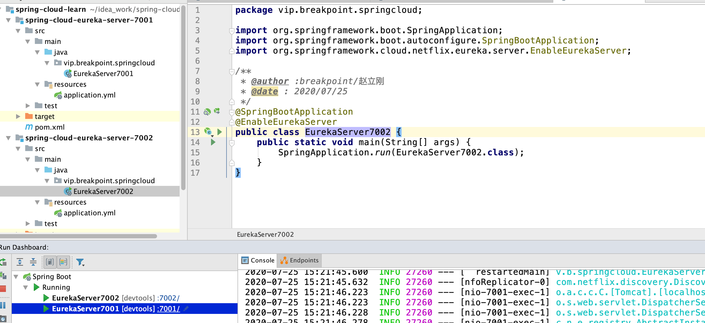
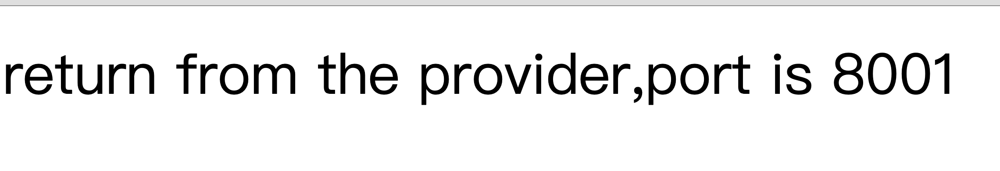

### 零、服务注册中心简介（服务治理）

> 服务的注册中心，顾名思义，就是管理我们的微服务的中心，动态的查看每一个微服务的状态，进行有效的管理。
>
> 与服务注册中心有关的三大角色：`服务提供者`、`服务消费者`、`服务注册中心`。

`服务提供者`、`服务消费者`、`服务注册中心`

它们之间的关系大致如下：

1. 各个微服务在启动时，将自己的网络地址等信息注册到注册中心，注册中心存储这些数据。
2. 服务消费者从注册中心查询服务提供者的地址，并通过该地址调用服务提供者的接口。
3. 各个微服务与注册中心使用一定机制（例如心跳）通信。如果注册中心与某微服务长时间无法通信，就会注销该实例。
4. 微服务网络地址发送变化（例如实例增加或IP变动等）时，会重新注册到注册中心。这样，服务消费者就无需人工修改提供者的网络地址了。

**服务注册中心的功能：**

服务注册表
> 服务注册表是注册中心的核心，它用来记录各个微服务的信息，例如微服务的名称、IP、端口等。服务注册表提供查询API和管理API，查询API用于查询可用的微服务实例，管理API用于服务的注册与注销。

服务注册与发现

> 服务注册是指微服务在启动时，将自己的信息注册到注册中心的过程。服务发现是指查询可用的微服务列表及网络地址的机制。

服务检查

> 注册中心使用一定的机制定时检测已注册的服务，如发现某实例长时间无法访问，就会从服务注册表移除该实例。

**Spring Cloud提供了多种注册中心的支持，例如Eureka、Consul和ZooKeeper等 以及阿里巴巴的nacos的服务注册中心。接下俩分别介绍每一种的服务注册中心**

### 一、Eureka 服务注册中心

> 简介：
>
> Eureka is a REST (Representational State Transfer) based service that is primarily used in the AWS cloud for locating services for the purpose of load balancing and failover of middle-tier servers.
>

**上面文字的翻译：**

> Eureka是一个基于REST (Representational State Transfer)的服务，主要用于AWS云中定位服务，以实现中间层服务器的负载平衡和故障转移。
>

Eureka的服务端与客户端都是由Java来进行编写，所以主要适用于通过Java实现的分布式系统。

#### 1.1 搭建服务注册中心

> 这次搭建的是单机版的服务注册中心，下面的搭建的是高可用的服务注册中心。

1. 首先我们创建maven工程，命名为 `spring-cloud-eureka-server-7001`，如下图：


修改pom.xml

```xml
<?xml version="1.0" encoding="UTF-8"?>
<project xmlns="http://maven.apache.org/POM/4.0.0"
         xmlns:xsi="http://www.w3.org/2001/XMLSchema-instance"
         xsi:schemaLocation="http://maven.apache.org/POM/4.0.0
         http://maven.apache.org/xsd/maven-4.0.0.xsd">
    <parent>
        <artifactId>spring-cloud-learn</artifactId>
        <groupId>com.breakpoint</groupId>
        <version>1.0-SNAPSHOT</version>
    </parent>
    <modelVersion>4.0.0</modelVersion>
    <packaging>jar</packaging>

    <artifactId>spring-cloud-eureka-server-7001</artifactId>

    <dependencies>
        <!-- 以后所有的操作都是带有stater  -->
        <!--   eureka-server    -->
        <dependency>
            <groupId>org.springframework.cloud</groupId>
            <artifactId>spring-cloud-starter-netflix-eureka-server</artifactId>
        </dependency>
        <!--   引入spring-boot支持的依赖  -->
        <dependency>
            <groupId>org.springframework.boot</groupId>
            <artifactId>spring-boot-starter-web</artifactId>
        </dependency>
        <!--  注意一下 要引入 starter 的  -->
        <dependency>
            <groupId>org.springframework.boot</groupId>
            <artifactId>spring-boot-starter-actuator</artifactId>
        </dependency>
        <dependency>
            <groupId>org.springframework.boot</groupId>
            <artifactId>spring-boot-devtools</artifactId>
            <scope>runtime</scope>
            <optional>true</optional>
        </dependency>
        <dependency>
            <groupId>org.projectlombok</groupId>
            <artifactId>lombok</artifactId>
        </dependency>
        <dependency>
            <groupId>org.springframework.boot</groupId>
            <artifactId>spring-boot-starter-test</artifactId>
            <scope>test</scope>
        </dependency>
    </dependencies>
</project>
```

2. 创建我们的主启动类：

```java
/**
 * @author :breakpoint/赵立刚
 * @date : 2020/07/25
 */
@SpringBootApplication
@EnableEurekaServer // 开始eureka的server服务
public class EurekaServer7001 {
    public static void main(String[] args) {
        SpringApplication.run(EurekaServer7001.class);
    }
}
```

3. 创建application.yml文件并且进行配置

```yaml
server:
  port: 7001 # 指定运行的端口
spring:
  application:
    name: cloud-eureka-server # 实例的名称
eureka:
  instance:
    hostname: localhost # 实例的hostname
  client:
    service-url:
      defaultZone: http://${eureka.instance.hostname}:${server.port}/eureka/ # 服务地址
    fetch-registry: false # 是否拉取服务信息
    register-with-eureka: false # 是否注册自己
```

4. 项目结构


5. 运行测试

访问本地：localhost:7001 如果出现下面的展示，说明，我们的服务注册中心搭建成功啦。


如果你的内存不够大，也可以加上启动参数：`-Xms128m -Xmx128m`

#### 1.2 搭建高可用服务注册中心

> 在分布式微服务中，最重要的是可用性，也就是说，我们的整体的服务是否可以进行使用。上面搭建的是单机版本的服务注册中心，可以思考一下，如果我们的注册中心宕机了，我们的整体的服务就会变成不可用的状态了，这时候，我们需要进行搭建一个高可用的服务注册中心，防止上面的事情的发生。

1. 按照上面的单机版，我们分别创建：7002，7003



配置我们的application.yml

7001:

```yaml
server:
  port: 7001 # 指定运行的端口
spring:
  application:
    name: cloud-eureka-server # 实例的名称
eureka:
  instance:
    hostname: peer1 # 实例的hostname
  client:
    service-url:
      defaultZone: http://peer2:7002/eureka/ # 服务地址
    fetch-registry: true # 是否拉取服务信息
    register-with-eureka: true # 是否注册自己
```

7002:

```yaml
server:
  port: 7002 # 指定运行的端口
spring:
  application:
    name: cloud-eureka-server # 实例的名称
eureka:
  instance:
    hostname: peer2 # 实例的hostname
  client:
    service-url:
      defaultZone: http://peer1:7001/eureka/ # 服务地址
    fetch-registry: true # 是否拉取服务信息
    register-with-eureka: true # 是否注册自己
```

我们可以看到上面是互相注册的。（peer1,peer2修改我们的hosts文件）

**启动运行测试：**

分别访问：http://peer1:7001/


看到上面的结果返回，说明我们配置成功啦。

> 既然有服务的注册中心，我们就要有服务的提供者以及服务的消费者

#### 1.3 搭建服务提供者服务

> 1. 创建 spring-cloud-eureka-client-provider-8001 服务提供者项目：
> 2. 配置pom.xml文件
> 3. 配置application.yml文件
> 4. 创建主启动类
> 5. 创建业务类
> 6. 运行测试

##### 1.3.1 创建服务提供者项目

根据上面创建的服务注册中心一样的操作，创建`spring-cloud-eureka-client-provider-8001`

##### 1.3.2 配置pom.xml文件

```xml
<?xml version="1.0" encoding="UTF-8"?>
<project xmlns="http://maven.apache.org/POM/4.0.0"
         xmlns:xsi="http://www.w3.org/2001/XMLSchema-instance"
         xsi:schemaLocation="http://maven.apache.org/POM/4.0.0
          http://maven.apache.org/xsd/maven-4.0.0.xsd">
    <parent>
        <artifactId>spring-cloud-learn</artifactId>
        <groupId>com.breakpoint</groupId>
        <version>1.0-SNAPSHOT</version>
    </parent>
    <modelVersion>4.0.0</modelVersion>
    <packaging>jar</packaging>

    <artifactId>spring-cloud-eureka-client-provider-8001</artifactId>

    <dependencies>
        <!-- 以后所有的操作都是带有stater  -->
        <!--   netflix-eureka-client 客户端 以后创建服务的消费者也是引入的 这个   -->
        <dependency>
            <groupId>org.springframework.cloud</groupId>
            <artifactId>spring-cloud-starter-netflix-eureka-client</artifactId>
        </dependency>
        <!--   引入spring-boot支持的依赖  -->
        <dependency>
            <groupId>org.springframework.boot</groupId>
            <artifactId>spring-boot-starter-web</artifactId>
        </dependency>
        <!--  注意一下 要引入 starter 的  -->
        <dependency>
            <groupId>org.springframework.boot</groupId>
            <artifactId>spring-boot-starter-actuator</artifactId>
        </dependency>
        <dependency>
            <groupId>org.springframework.boot</groupId>
            <artifactId>spring-boot-devtools</artifactId>
            <scope>runtime</scope>
            <optional>true</optional>
        </dependency>
        <dependency>
            <groupId>org.projectlombok</groupId>
            <artifactId>lombok</artifactId>
        </dependency>
        <dependency>
            <groupId>org.springframework.boot</groupId>
            <artifactId>spring-boot-starter-test</artifactId>
            <scope>test</scope>
        </dependency>
    </dependencies>
</project>
```

##### 1.3.3 配置application.yml文件

```yaml
server:
  port: 8001 # 配置端口号
eureka:
  client:
    register-with-eureka: true # 是否向注册中心注册自己
    fetch-registry: true # 是否拉去相关配置信息
    service-url: 
      defaultZone: http://peer1:7001/eureka/,http://peer2:7002/eureka/  # 服务的注册中心 高可用的模式
  instance:
    prefer-ip-address: true # 是否展示真实的自己的IP
    instance-id: ${spring.application.name}:${server.port} # 自己服务的实例的名称
spring:
  application:
    name: cloud-eureka-client-provider # 服务的名称
```

##### 1.3.4 创建主启动类

```java
/**
 * @author :breakpoint/赵立刚
 * @date : 2020/07/25
 */
@SpringBootApplication
@EnableDiscoveryClient
@EnableEurekaClient
public class EurekaClientProvider8001 {

    public static void main(String[] args) {
        SpringApplication.run(EurekaClientProvider8001.class, args);
    }
}
```

##### 1.3.5 创建业务类

```java
/**
 * @author :breakpoint/赵立刚
 * @date : 2020/07/25
 */
@Slf4j
@RestController
public class EurekaProviderController {

    @Value("${server.port}")
    private String serverPort;

    @GetMapping("/getServerPort")
    public String getServerPort() {
        return "return from the provider,port is " + serverPort;
    }
}
```

##### 1.3.6运行测试

首先启动服务注册中心 7001、7002

然后启动服务提供者：


上面的是我们启动之后的结果；

测试一下业务类：



至此，我们的服务提供者搭建成功。

#### 1.4 搭建服务消费者服务

> 同样的道理，搭建我们的服务的消费者

> 待续


### 二、Consul 服务注册中心

> 待续


### 三、ZooKeeper 服务注册中心

> 待续

### 四、nacos服务注册中心

> 待续

