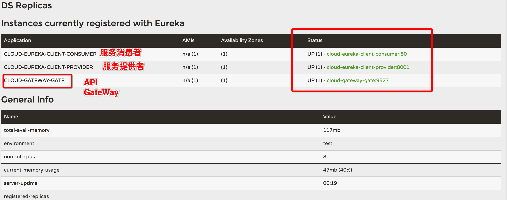

### 服务网关（Spring-Cloud-GateWay）

> 在讲述网关之前，首先，看一下，当前的网络架构：
>
> 

其中API GateWay是整个系统最前面的，与用户的客户端直接关联的。

> **介绍：**
>
> This project provides a library for building an API Gateway on top of `Spring MVC`. Spring Cloud Gateway aims to provide a simple, yet effective way to route to APIs and provide cross cutting concerns to them such as: security, monitoring/metrics, and resiliency.
>
> **特性：**
>
> Spring Cloud Gateway features:
>
> - Built on `Spring Framework 5`, `Project Reactor` and `Spring Boot 2.0`
> - Able to match routes on any request attribute.
> - `Predicates` and `filters` are specific to routes.
> - Hystrix Circuit Breaker integration.
> - Spring Cloud DiscoveryClient integration
> - Easy to write Predicates and Filters
> - `Request Rate Limiting`
> - `Path Rewriting`

### 一、简介

> Springcloud GateWay 底层使用了webflux中的reactor-netty响应式编程组件，底层使用了netty的通信组件

#### 1.1 三大概念

- **Route**: The basic building block of the gateway. It is defined by an ID, a destination URI, a collection of predicates, and a collection of filters. A route is matched if the aggregate predicate is true.
- **Predicate**: This is a [Java 8 Function Predicate](https://docs.oracle.com/javase/8/docs/api/java/util/function/Predicate.html). The input type is a [Spring Framework `ServerWebExchange`](https://docs.spring.io/spring/docs/5.0.x/javadoc-api/org/springframework/web/server/ServerWebExchange.html). This lets you match on anything from the HTTP request, such as headers or parameters.
- **Filter**: These are instances of [Spring Framework `GatewayFilter`](https://docs.spring.io/spring/docs/5.0.x/javadoc-api/org/springframework/web/server/GatewayFilter.html) that have been constructed with a specific factory. Here, you can modify requests and responses before or after sending the downstream request.

#### 1.2 功能

反向代理

鉴权

流量控制

熔断

日志监控

等等等其他的功能

#### 1.3 为什么选择GateWay

首先：netflix不太靠谱，zuul 2.0一直跳票，迟迟不发布

其次：Springcloud的gateway的优秀特性

异步非阻塞模型

> 基于Spring 5, Spring Boot 2 and Project Reactor的构建
>
> 动态路由，能够匹配任何的请求属性
>
> 可以对路由指定predicate(断言)和filter（过滤器）
>
> 集成hystrix断路器的功能
>
> 集成Springcloud的服务发现功能
>
> 易于编写的predicate(断言)和filter（过滤器）
>
> 请求限流功能
>
> 支持路径重写

#### 1.4 springcloud gateway与zuul的区别

> Zuul 1.x 底层是一个阻塞的IO API的gateway
>
> Zuul 1.x 基于servlet2.5，使用阻塞的架构，不支任何的长连接。

#### 1.5 gateway模型
基于 spring-webflux
https://docs.spring.io/spring/docs/5.2.8.RELEASE/spring-framework-reference/web-reactive.html#spring-webflux

#### 1.6 GATEWAY工作流程

**Clients make requests to Spring Cloud Gateway. If the Gateway Handler Mapping determines that a request matches a route, it is sent to the Gateway Web Handler. This handler runs the request through a filter chain that is specific to the request. The reason the filters are divided by the dotted line is that filters can run logic both before and after the proxy request is sent. All “pre” filter logic is executed. Then the proxy request is made. After the proxy request is made, the “post” filter logic is run.**

### 二、编写代码，进行测试

#### 2.1. 新建项目

> 新建立我们的项目：spring-cloud-gateway-gateway9527 模块

#### 2.2.配置项目

Pom.xml

```xml
<?xml version="1.0" encoding="UTF-8"?>
<project xmlns="http://maven.apache.org/POM/4.0.0"
         xmlns:xsi="http://www.w3.org/2001/XMLSchema-instance"
         xsi:schemaLocation="http://maven.apache.org/POM/4.0.0 http://maven.apache.org/xsd/maven-4.0.0.xsd">
    <parent>
        <artifactId>spring-cloud-learn</artifactId>
        <groupId>com.breakpoint</groupId>
        <version>1.0-SNAPSHOT</version>
    </parent>
    <modelVersion>4.0.0</modelVersion>
    <packaging>jar</packaging>
    <artifactId>spring-cloud-gateway-gateway9527</artifactId>
    <dependencies>
        <!--  gateway 的配置  -->
        <dependency>
            <groupId>org.springframework.cloud</groupId>
            <artifactId>spring-cloud-starter-gateway</artifactId>
        </dependency>
        <!-- erureka-->
        <dependency>
            <groupId>org.springframework.cloud</groupId>
            <artifactId>spring-cloud-starter-netflix-eureka-client</artifactId>
        </dependency>
        <dependency>
            <groupId>org.springframework.boot</groupId>
            <artifactId>spring-boot-devtools</artifactId>
            <scope>runtime</scope>
            <optional>true</optional>
        </dependency>
        <dependency>
            <groupId>org.projectlombok</groupId>
            <artifactId>lombok</artifactId>
        </dependency>
        <dependency>
            <groupId>org.springframework.boot</groupId>
            <artifactId>spring-boot-starter-test</artifactId>
            <scope>test</scope>
        </dependency>
    </dependencies>

</project>
```

Application.yml:

```yaml
server:
  port: 9527
spring:
  application:
    name: cloud-gateway-gate
  cloud:
    gateway:
      enabled: true # 是否开启gateway的功能，默认是你开启的状态
      routes:
      - id: consumer_routh # 路由的ID ，没有固定的要求，但是唯一 建议使用服务名
        #uri:  http://localhost:80/
        uri:  lb://CLOUD-EUREKA-CLIENT-CONSUMER # 根据服务名动态的配置 实现 动态配置路由的目的
        predicates:
        - Path=/consumer/feign/**
      discovery:
        locator:
          # 如果不是动态的路由，这里可以不需要进行开启的
          enabled: true # Flag that enables DiscoveryClient gateway integration

eureka:
  instance:
    instance-id: ${spring.application.name}:${server.port}
    prefer-ip-address: true
  client:
    service-url:
      #defaultZone: http://peer1:7001/eureka/,http://peer2:7002/eureka/ # 服务的注册中心 高可用的模式
      defaultZone: http://peer1:7001/eureka/  # 服务的注册中心 单机版模式
    register-with-eureka: true
    fetch-registry: true
```

**启动类：**

```java
/**
 * @author :breakpoint/赵立刚
 * @date : 2020/07/27
 */
@SpringBootApplication
@EnableDiscoveryClient
public class GateWayMain9527 {

    public static void main(String[] args) {
        SpringApplication.run(GateWayMain9527.class, args);
    }
}
```

#### 2.3.测试



**测试结果：**


成功调用我们的后台服务，起到了一定的作用。

#### 2.4.后记

由于zuul1.x已经停止了更新，zuul2.x正在开发中，所以Spring自己除了一套网关组件。

另外，还有其他额度配置，详细的配置请参考官方文档。

https://cloud.spring.io/spring-cloud-static/Hoxton.SR1/reference/htmlsingle/#spring-cloud-gateway

代码小结：https://github.com/zhaoligang594/spring-cloud-learn/releases/tag/7.0.0

---

**{docsify-updated}** 

