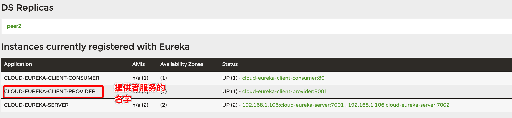
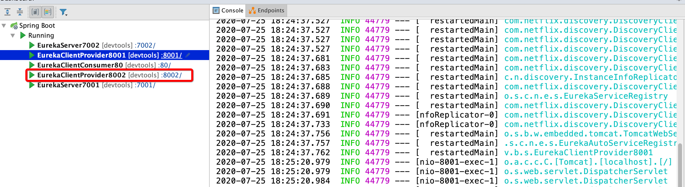
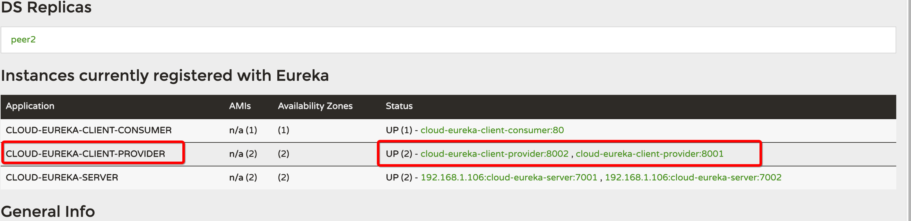
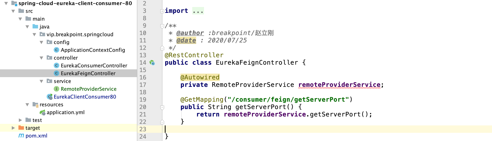

### 简介

> 在https://github.com/zhaoligang594/spring-cloud-learn/releases/tag/1.0.0 这个版本中，服务消费者的代码请求地址直接写在了项目里面了：

例如：

```java
/**
 * @author :breakpoint/赵立刚
 * @date : 2020/07/25
 */
@RestController
public class EurekaConsumerController {
  	// 直接写的是我们的IP地址；
    private static final String REQUEST_URL = "http://localhost:8001/";
    @Autowired
    private RestTemplate restTemplate;
    @GetMapping("/consumer/getServerPort")
    public String getServerPort() {
        return restTemplate.getForObject(REQUEST_URL + "/getServerPort", String.class);
    }

}
```

> 我们注意到，上面的代码，我们抱服务额提供者的IP直接写在了代码里，很方便，但是，如果我们的IP变动了，我们要要修改好多这样的问题，增加了不必要的工作量。他么有没有其他的方式，来做到一次配置不用改变呢？
>
> 答案是肯定的，我们可以利用下面的技术来进行调用我们的服务。

远程调用主要技术有：

**`ribbon、loadblancer、feign、openfeign`** 这四种方式调用，下面分别介绍这四种调用技术。

### 一、ribbon远程服务调用

> 官网：https://github.com/Netflix/ribbon
>
> 简介：
>
> Ribbon is a client-side load balancer that gives you a lot of control over the behavior of HTTP and TCP clients. Feign already uses Ribbon, so, if you use `@FeignClient`, this section also applies.
>
> 
>
> ------------------
>
> Ribbon is a client side IPC library that is battle-tested in cloud. It provides the following features
>
> - Load balancing
> - Fault tolerance
> - Multiple protocol (HTTP, TCP, UDP) support in an asynchronous and reactive model
> - Caching and batching
>
> {
>
> 上面的翻译：
>
> Ribbon是一个客户端IPC库，在云中进行了战斗测试。它提供了以下特性
>
> - 负载平衡
> - 容错
>
> - 多协议(HTTP, TCP, UDP)支持异步和反应模型
> - 缓存和批处理
>
> }
>
> 上面就是ribbon为大家提供的功能。

我们接下来就`测试远程调用`以及`负载均衡`：

#### 1.1 远程调用

> 在我们的项目中引入ribbon依赖：

```xml
<!--  netflix-ribbon  -->
<dependency>
    <groupId>org.springframework.cloud</groupId>
    <artifactId>spring-cloud-starter-netflix-ribbon</artifactId>
</dependency>
```

修改我们的业务类：

```java
/**
 * @author :breakpoint/赵立刚
 * @date : 2020/07/25
 */
@RestController
public class EurekaConsumerController {

    // CLOUD-EUREKA-CLIENT-PROVIDER 是我们的服务提供者的名字
    private static final String REQUEST_URL = "http://CLOUD-EUREKA-CLIENT-PROVIDER";
    @Autowired
    private RestTemplate restTemplate;
    @GetMapping("/consumer/getServerPort")
    public String getServerPort() {
        return restTemplate.getForObject(REQUEST_URL + "/getServerPort", String.class);
    }

}
```

测试一下：



访问：http://localhost/consumer/getServerPort 也可以返回我们想要得到的数据。

这样集成我们的ribbon是成功的。

> 实质上，eureka默认就是使用ribbon来进行调用的。

#### 1.2 负载均衡

> 有些时候，我们的服务提供者不可能是一个服务，有可能是多个服务，这个时候，我们对客户算进行负载均衡。

**新建我们的服务提供者spring-cloud-eureka-client-provider-8002，过程与8001一致，之后启动我们新建的服务提供者**







修改我们的ApplicationContextConfig ：

```java
@Configuration
public class ApplicationContextConfig {

    @LoadBalanced // 进行负载均衡
    @Bean
    public RestTemplate getRestTemplate() {
        return new RestTemplate();
    }
}
```

调用测试：

> 我们发现采用的轮询的方式分别进行调用我们的服务提供者。

**项目代码小结：https://github.com/zhaoligang594/spring-cloud-learn/releases/tag/2.0.0**

### 二、openfeign 远程服务调用

> 后起之秀肯定有他的优点，openfeign的底层也是用ribbon来实现的。
>
> 通过刚刚的编码，我们或多或少感觉到，编码还是不太顺滑鱼简单，而且步骤很复杂，我们能不能用以往的service调用呢，答案是肯定的，我们可以利用openfeign。
>
> openfeign 与feign实质上差不多是一样的，都是客户端的调用。

> `所有的远程调用均是在服务的消费端进行调用的。`

#### 1.**在我们的项目中，引入关于openfeign的依赖**

```xml
<!--  spring-cloud-starter-openfeign  -->
<dependency>
   <groupId>org.springframework.cloud</groupId>
   <artifactId>spring-cloud-starter-openfeign</artifactId>
</dependency>
```

修改我们的代码结构：

#### 2. 修改主启动类

> 在我们的服务消费侧进行修改

```java
/**
 * @author :breakpoint/赵立刚
 * @date : 2020/07/25
 */
@EnableFeignClients // 加上这个
@SpringBootApplication
@EnableDiscoveryClient
public class EurekaClientConsumer80 {

    public static void main(String[] args) {
        SpringApplication.run(EurekaClientConsumer80.class, args);
    }

}
```

#### 3. 修改我们的业务逻辑代码

```java
/**
 * @author :breakpoint/赵立刚
 * @date : 2020/07/26
 */
@FeignClient(value = "CLOUD-EUREKA-CLIENT-PROVIDER") //服务的名字
public interface RemoteProviderService {

    // 远程服务的接口
    @GetMapping("/getServerPort")
    public String getServerPort();
}
```

#### 4. 修改我们的接口

```java
/**
 * @author :breakpoint/赵立刚
 * @date : 2020/07/25
 */
@RestController
public class EurekaFeignController {

  	// 注入我们刚才新建立的服务
    @Autowired
    private RemoteProviderService remoteProviderService;

    @GetMapping("/consumer/feign/getServerPort")
    public String getServerPort() {
        return remoteProviderService.getServerPort();
    }

}
```

#### 5.整体的项目结构



#### 6.运行测试

测试结果是正确的。

> 这样，完成了openfeign的调用工作。

代码地址：https://github.com/zhaoligang594/spring-cloud-learn/releases/tag/3.0.0

----


**{docsify-updated}** 

