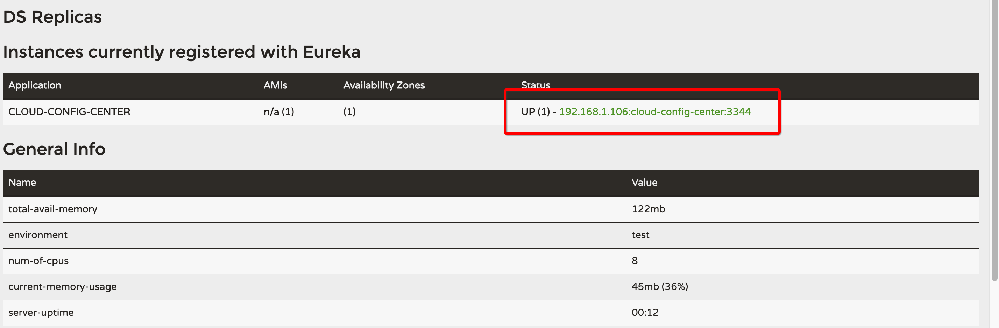
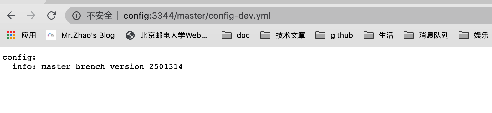
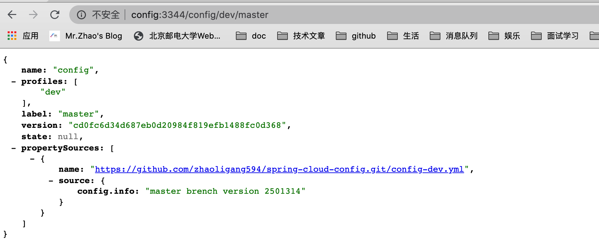
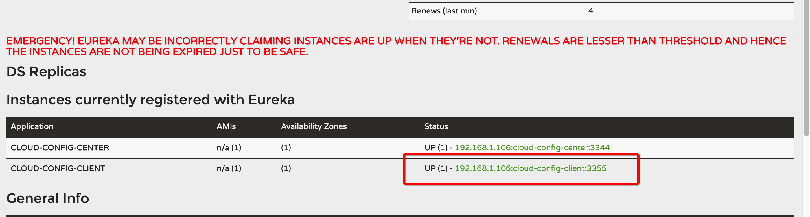
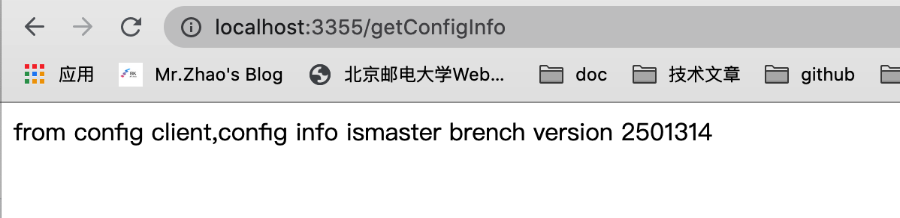
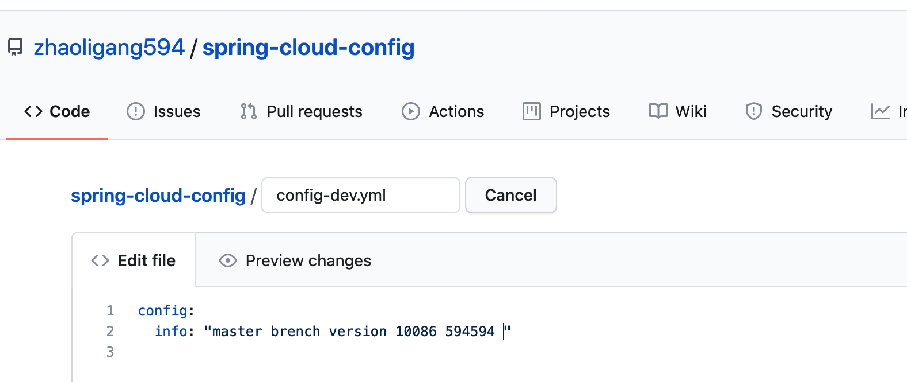
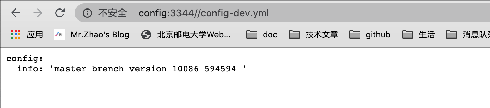
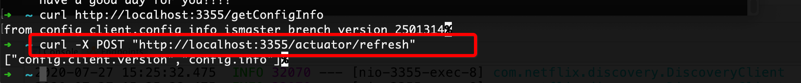
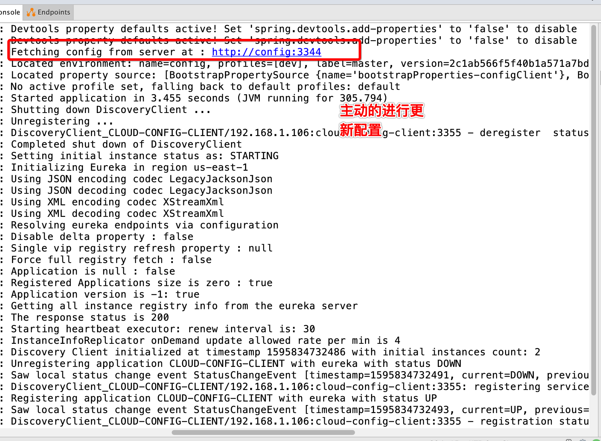
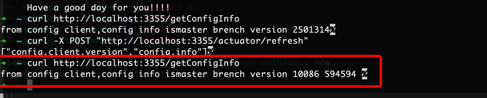

### 服务配置（Spring Cloud Config）

> 相对比较重要的，现在还是有人在用的


### 一、简述

> 文档：https://cloud.spring.io/spring-cloud-static/Hoxton.SR1/reference/htmlsingle/#spring-cloud-config
>
> 官网：https://github.com/spring-cloud/spring-cloud-config

Spring Cloud Config provides server-side and client-side support for externalized configuration in a distributed system. With the Config Server, you have a central place to manage external properties for applications across all environments. The concepts on both client and server map identically to the Spring `Environment` and `PropertySource` abstractions, so they fit very well with Spring applications but can be used with any application running in any language. As an application moves through the deployment pipeline from dev to test and into production, you can manage the configuration between those environments and be certain that applications have everything they need to run when they migrate. The default implementation of the server storage backend uses git, so it easily supports labelled versions of configuration environments as well as being accessible to a wide range of tooling for managing the content. It is easy to add alternative implementations and plug them in with Spring configuration.

> Spring Cloud Config为分布式系统中的外部化配置提供了`服务器端`和`客户端`支持。有了`配置服务器`，您就有了一个中心位置来管理跨所有环境的应用程序的外部属性。客户端和服务器上的概念与Spring的“环境”和“PropertySource”抽象完全相同，因此它们非常适合Spring应用程序，但也可以用于任何语言运行的任何应用程序。当应用程序通过部署管道从dev转移到测试和生产时，您可以管理这些环境之间的配置，并确保应用程序在迁移时拥有运行所需的一切。服务器存储后端的默认实现使用git，因此它很容易支持带标签的配置环境版本，并且可以访问用于管理内容的各种工具。添加替代实现并将其插入到Spring配置中是很容易的。

#### 1.1 分布式系统面临的问题

配置文件的维护以及更新会需要大量的时间经历来维护，所以我们需要一个可以集中式、动态配置的管理设施是必不可少的。

#### 1.2 这个配置中心他是什么，有什么作用？

SpringCloud Config 为微服务架构中的微服务提供了集中化的外部配置支持。配置的服务器为不同的微服务应用提供了一个中心化的外部配置。

Spring Cloud Config provides server and client-side support for externalized configuration in a distributed system. With the Config Server you have a central place to manage external properties for applications across all environments.

#### 1.3 能做什么？

> 集中管理配置文件
>
> 不同环境，不同配置，动态化配置更新、分环境进行部署，比如：dev\beta\prod\release
>
> 运行期间，动态的调整配置，不需要在每一个服务部署的机器上面编写胚子文件，服务回想配置中心统一拉取的配置 自己的信息。
>
> 当配置发生变动的时候，服务不需要重启就可以感知配置的变化、并且直接应用新的配置。
>
> 将配置的信息用rest接口的形式进行暴露

#### 1.4 相关网址

https://spring.io/projects/spring-cloud-config

https://cloud.spring.io/spring-cloud-static/spring-cloud-config/2.2.1.RELEASE/reference/html/

### 二、具体的编写代码

#### 2.1 项目环境

在https://github.com/zhaoligang594/spring-cloud-learn/releases/tag/7.0.0 代码的基础上，新增我们的代码。

#### 2.2 新增配置中心模块

新建一个module，命名为：spring-cloud-config-config3344

#### 2.3 配置新建立的项目

**pom.xml**

```xml
<?xml version="1.0" encoding="UTF-8"?>
<project xmlns="http://maven.apache.org/POM/4.0.0"
         xmlns:xsi="http://www.w3.org/2001/XMLSchema-instance"
         xsi:schemaLocation="http://maven.apache.org/POM/4.0.0 http://maven.apache.org/xsd/maven-4.0.0.xsd">
    <parent>
        <artifactId>spring-cloud-learn</artifactId>
        <groupId>com.breakpoint</groupId>
        <version>1.0-SNAPSHOT</version>
    </parent>
    <modelVersion>4.0.0</modelVersion>
    <packaging>jar</packaging>

    <artifactId>spring-cloud-config-config3344</artifactId>

    <dependencies>
        <!--  spring-cloud-config-server 服务的配置中心   -->
        <dependency>
            <groupId>org.springframework.cloud</groupId>
            <artifactId>spring-cloud-config-server</artifactId>
        </dependency>
        <!-- 以后所有的操作都是带有stater  -->
        <!--   netflix-eureka-client    -->
        <dependency>
            <groupId>org.springframework.cloud</groupId>
            <artifactId>spring-cloud-starter-netflix-eureka-client</artifactId>
        </dependency>
        <!--   引入spring-boot支持的依赖  -->
        <dependency>
            <groupId>org.springframework.boot</groupId>
            <artifactId>spring-boot-starter-web</artifactId>
        </dependency>
        <!--  注意一下 要引入 starter 的  -->
        <dependency>
            <groupId>org.springframework.boot</groupId>
            <artifactId>spring-boot-starter-actuator</artifactId>
        </dependency>
        <dependency>
            <groupId>org.springframework.boot</groupId>
            <artifactId>spring-boot-devtools</artifactId>
            <scope>runtime</scope>
            <optional>true</optional>
        </dependency>
        <dependency>
            <groupId>org.projectlombok</groupId>
            <artifactId>lombok</artifactId>
        </dependency>
        <dependency>
            <groupId>org.springframework.boot</groupId>
            <artifactId>spring-boot-starter-test</artifactId>
            <scope>test</scope>
        </dependency>
    </dependencies>

</project>
```

**application.yml**

```yaml
server:
  port: 3344
spring:
  application:
    name: cloud-config-center # 注册进eureka的服务的名字
  cloud:
    config:
      label: master # 分支的名称
      server:
        git:
          uri: https://github.com/zhaoligang594/spring-cloud-config.git # 我们的git地址
          search-paths:
            - spring-cloud-config # 搜索的文件夹
# 服务的注册地址
eureka:
  client:
    register-with-eureka: true
    fetch-registry: true
    service-url:
      defaultZone: http://peer1:7001/eureka/
```

#### 2.4 新建启动类

```java
/**
 * @author :breakpoint/赵立刚
 * @date : 2020/07/27
 */
@EnableConfigServer
@EnableDiscoveryClient
@SpringBootApplication
public class ConfigCenter3344 {

    public static void main(String[] args) {
        SpringApplication.run(ConfigCenter3344.class, args);
    }
}
```

#### 2.5 启动测试

> 分别启动服务的注册中心7001以及当前的配置中心3344.



> 根据上面的图片，我们知道，我们已经把我们的配置中心注册到eureka的服务注册中心上了。

#### 2.6 测试结果

> 访问浏览器，直接请求 http://config:3344/master/config-dev.yml 查看结果。



> `注意：` 在我们的git上面新建立一个仓库。spring-cloud-config 地址是：https://github.com/zhaoligang594/spring-cloud-config.git
>
> 之后新建文件：config-dev.yml
>
> 里面的内容：
>
> ```yaml
> config:
>   info: "master brench version 2501314"
> ```

本地的请求地址的确定：

> 官方为我们提供了多种的请求的方式：
>
> ```shell
> /{application}/{profile}[/{label}]
> /{application}-{profile}.yml
> /{label}/{application}-{profile}.yml
> /{application}-{profile}.properties
> /{label}/{application}-{profile}.properties
> ```

我们接下来就测试一下其他的吧：

**/{application}/{profile}[/{label}]**




其他的都是类似的情形。

### 三、配置中心的客户端

> 上面的代码仅仅是配置了一个管理所有配置的配置中心，如果某一个服务想要动态的从配置中心拿到自己的配置信息，这个时候，我们就要修改我们的服务模块。

#### 3.1 新建模块

新建spring-cloud-config-client-3355 的模块，与上面创建的过程大致相同。

#### 3.2 项目配置

**pom.xml**

```xml
<?xml version="1.0" encoding="UTF-8"?>
<project xmlns="http://maven.apache.org/POM/4.0.0"
         xmlns:xsi="http://www.w3.org/2001/XMLSchema-instance"
         xsi:schemaLocation="http://maven.apache.org/POM/4.0.0 http://maven.apache.org/xsd/maven-4.0.0.xsd">
    <parent>
        <artifactId>spring-cloud-learn</artifactId>
        <groupId>com.breakpoint</groupId>
        <version>1.0-SNAPSHOT</version>
    </parent>
    <modelVersion>4.0.0</modelVersion>
    <packaging>jar</packaging>

    <artifactId>spring-cloud-config-client-3355</artifactId>

    <dependencies>
        <!--  添加消息总线的支持   -->
        <dependency>
            <groupId>org.springframework.cloud</groupId>
            <artifactId>spring-cloud-starter-bus-amqp</artifactId>
        </dependency>

        <!--  客户端的配置方式  -->
        <!--  spring-cloud-config 服务的配置中心  注意与服务的配置中心引入的是不同的依赖  -->
        <dependency>
            <groupId>org.springframework.cloud</groupId>
            <artifactId>spring-cloud-starter-config</artifactId>
        </dependency>

        <!-- erureka-->
        <dependency>
            <groupId>org.springframework.cloud</groupId>
            <artifactId>spring-cloud-starter-netflix-eureka-client</artifactId>
        </dependency>

        <dependency>
            <groupId>org.springframework.boot</groupId>
            <artifactId>spring-boot-starter-web</artifactId>
        </dependency>
        <!--  注意一下 要引入 starter 的  -->
        <dependency>
            <groupId>org.springframework.boot</groupId>
            <artifactId>spring-boot-starter-actuator</artifactId>
        </dependency>
        <dependency>
            <groupId>org.springframework.boot</groupId>
            <artifactId>spring-boot-devtools</artifactId>
            <scope>runtime</scope>
            <optional>true</optional>
        </dependency>
        <dependency>
            <groupId>org.projectlombok</groupId>
            <artifactId>lombok</artifactId>
        </dependency>
        <dependency>
            <groupId>org.springframework.boot</groupId>
            <artifactId>spring-boot-starter-test</artifactId>
            <scope>test</scope>
        </dependency>
    </dependencies>

</project>
```

*bootstarp.yml*

```yaml
server:
  port: 3355
spring:
  application:
    name: cloud-config-client
  cloud:
    config:
      label: master  # label
      name: config   # name
      profile: dev   # 哪一个
      uri: http://config:3344 # 合在一起：http://config:3344/master/config-dev.yml
eureka:
  client:
    service-url:
      defaultZone: http://peer1:7001/eureka/
# 下面属于动态刷新的部分
management:
  endpoints:
    web:
      exposure:
        include: "*"
# 之后配合 @RefreshScope
#用 curl -X POST "http://localhost:3355/actuator/refresh" 手动进行刷新
```

#### 3.3 启动类

```java
/**
 * @author :breakpoint/赵立刚
 * @date : 2020/07/27
 */
@SpringBootApplication
@EnableDiscoveryClient
public class ConfigClient3355 {

    public static void main(String[] args) {
        SpringApplication.run(ConfigClient3355.class, args);
    }
}
```

#### 3.4 新增业务类

```java
/**
 * @author :breakpoint/赵立刚
 * @date : 2020/07/27
 */
@RestController
public class TestController {

    @Value("${config.info}")
    private String configInfo;


    @GetMapping("/getConfigInfo")
    public String getConfigInfo() {
        return "from config client,config info is" + configInfo;
    }

}
```

#### 3.5 测试运行






> 至此，发现，我们成功的将我们的配置中心的信息，加载到我们自己的项目里面了。

### 四、其他的问题（配置的更新）

> 虽然，我们已经配置好了我们的客户端，我们的配置中心的功能是统一的维护我们的配置的信息，但是假设每次修改一次配置信息，就要从新修改一次，是不是会造成一些一向不到的问题呢？

#### 4.1 针对上面的问题的解决

**修改业务类**

```java
@RefreshScope // 加上可以更新的注解
@RestController
public class TestController {

    @Value("${config.info}")
    private String configInfo;


    @GetMapping("/getConfigInfo")
    public String getConfigInfo() {
        return "from config client,config info is" + configInfo;
    }

}
```

**修改github上的数据**




**测试配置中心**



> 可以发现，配置中心是实时更新的。

**客户端测试**


> 发现客户端没有变化。

**使用命令更新：**

```shell
curl -X POST "http://localhost:3355/actuator/refresh"
```



查看后台的打印：



访问：



> 发现更新了。

### 五、后记

对于上面问题的思考？

我们想要更新我们的配置，达到了不用重新启动我们的服务，但是还是存在一个问题。

如果我们的服务存在成千上万个，那是不是导致了不必要的成本，那么在 **`消息总线`** 就是解决这个问题的。

---

> 代码小结：https://github.com/zhaoligang594/spring-cloud-learn/releases/tag/8.0.0

---

**{docsify-updated}** 

