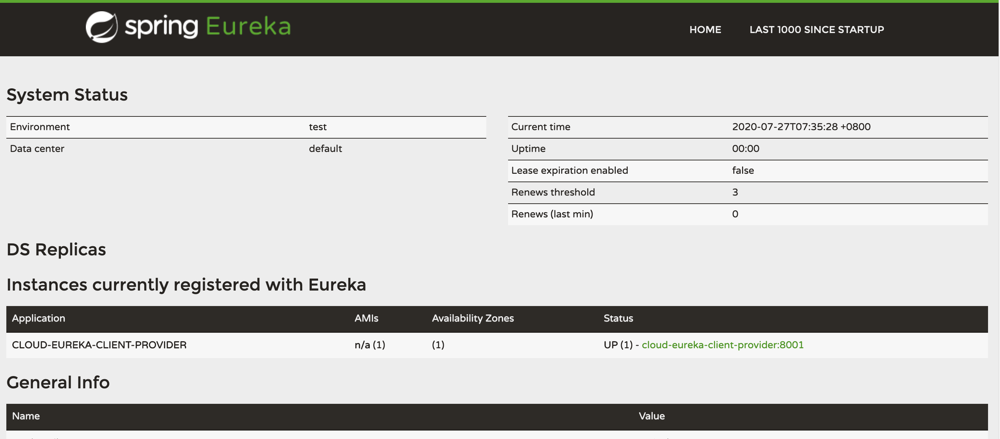
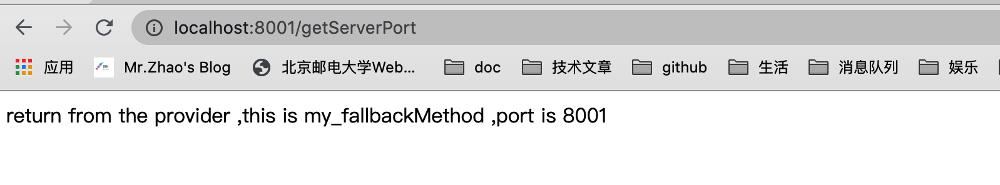
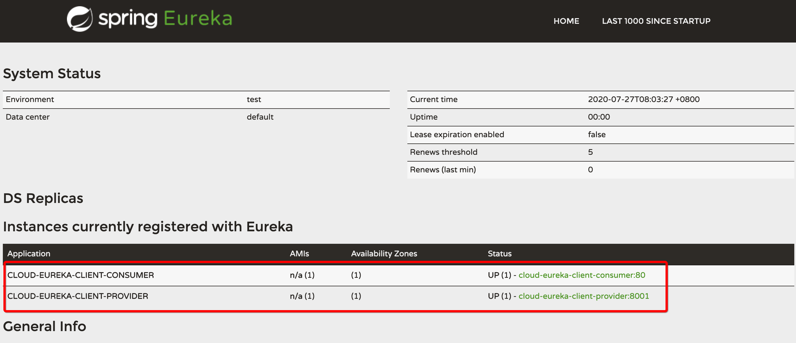
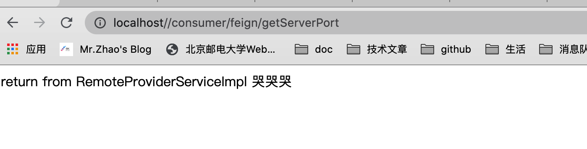
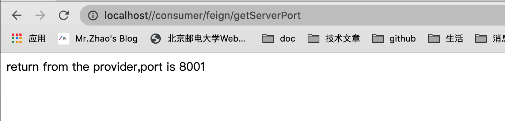

### 服务降级（服务的容错保护）

> 在微服务架构中，我们将系统拆分成多个服务单元。个单元的应用间通过服务注册与订阅的方式互相依赖。由于每一个单元都在不同的进程中进行运行，依赖通过远程调用的方式进行执行。这样就有课呢个由于网络以及其他的原因出现调用故障或者延迟。而这些问题也直接导致调用方对于外服务出现延迟。诺此时的请求不断的增加，最后就会因为等待出现故障的依赖响应形成任务的积压，最终导致自身的服务失败。

> 实现这样的功能主要有：sentinel、hystrix

> 服务的容错保护包含了2大部分：`服务降级`、`服务熔断`

> **服务降级：**
>
> 服务降级是当服务器压力剧增的情况下，根据当前业务情况及流量对一些服务和页面有策略的降级，以此释放服务器资源以保证核心任务的正常运行。
>
> 当整个微服务架构整体的负载超出了预设的上限阈值或即将到来的流量预计将会超过预设的阈值时，为了保证重要或基本的服务能正常运行，我们可以将一些不重要或不紧的服务或任务进行服务的延迟使用或暂停使用。
>
> 超时降级: 主要配置好 超时时间 和 超时重试次数 机制，并使用 异步机制 探测恢复情况.
>
> 失败次数降级: 主要是一些不稳定的API，当失败调用次数达到一定阀值自动降级，同样要使用异步机制探测回复情况.
>
> 故障降级: 如要调用的远程服务挂掉了（网络故障、DNS故障、HTTP服务返回错误的状态码和RPC服务抛出异常），则可以直接降级.
>
> 限流降级: 当触发了限流超额时，可以使用暂时屏蔽的方式来进行短暂的屏蔽.
>
> 比如秒杀或抢购一些限购商品时，此时可能会因为访问量太大而导致系统崩溃，此时会使用限流来进行限制访问量，当达到限流阀值，后续请求会被降级.
>
> 降级后的处理方案可以是：排队页面（将用户导流到排队页面等一会重试）、无货（直接告知用户没货了）、错误页（如活动太火爆了，稍后重试）。

> **服务熔断:**
>
> 服务熔断的作用类似于我们家用的保险丝，当某服务出现不可用或响应超时的情况时，为了防止整个系统出现雪崩，暂时停止对该服务的调用。
>
> 1.开启熔断
>
> 在固定时间窗口内，接口调用超时比率达到一个阈值，会开启熔断。进入熔断状态后，后续对该服务接口的调用不再经过网络，直接执行本地的默认方法，达到服务降级的效果。
>
> 2.熔断回复
>
> 熔断不可能是永久的。当经过了规定时间之后，服务将从熔断状态回复过来，再次接受调用方的远程调用。

**马丁福勒的论文**

https://martinfowler.com/articles/microservices.html

### 一、服务容错保护 Spring Cloud Hystrix

**消费侧以及服务侧都可以进行做降级的操作**

> 是一个用于分布式系统，延迟和容错的开源库。Hystrix  可以让我们在分布式系统中对服务间的调用进行控制，加入一些调用延迟或者依赖故障的容错机制。Hystrix  通过将依赖服务进行资源隔离，进而阻止某个依赖服务出现故障时在整个系统所有的依赖服务调用中进行蔓延；同时Hystrix 还提供故障时的  fallback 降级机制。    总而言之，Hystrix 通过这些方法帮助我们提升分布式系统的可用性和稳定性。

#### 1.1 他可以做什么？

服务降级

服务熔断

接近实时的监控

限流、隔离 。。。。。。

#### 1.2 官网的介绍

https://github.com/Netflix/Hystrix/wiki

> Spring Cloud Hystrix是基于Netflix的开源框架Hystrix实现，该框架实现了服务熔断、线程隔离等一系列服务保护功能。
>
>  对于熔断机制的实现，Hystrix设计了三种状态：
>
> 1.熔断关闭状态（Closed）
>
> 服务没有故障时，熔断器所处的状态，对调用方的调用不做任何限制。
>
> 2.熔断开启状态（Open）
>
> 在固定时间窗口内（Hystrix默认是10秒），接口调用出错比率达到一个阈值（Hystrix默认为50%），会进入熔断开启状态。进入熔断状态后，后续对该服务接口的调用不再经过网络，直接执行本地的fallback方法。
>
> 3.半熔断状态（Half-Open）
>
> 在进入熔断开启状态一段时间之后（Hystrix默认是5秒），熔断器会进入半熔断状态。所谓半熔断就是尝试恢复服务调用，允许有限的流量调用该服务，并监控调用成功率。如果成功率达到预期，则说明服务已恢复，进入熔断关闭状态；如果成功率仍旧很低，则重新进入熔断关闭状态。

**但是，现在hystrix进入了维护的状态，害**

`Hystrix is no longer in active development, and is currently in maintenance mode.`

简介：In a distributed environment, inevitably some of the many service dependencies will fail. Hystrix is a library that helps you control the interactions between these distributed services by adding latency tolerance and fault tolerance logic. Hystrix does this by isolating points of access between the services, stopping cascading failures across them, and providing fallback options, all of which improve your system’s overall resiliency.

功能：

Hystrix is designed to do the following:

- Give protection from and control over latency and failure from dependencies accessed (typically over the network) via third-party client libraries.
- Stop cascading failures in a complex distributed system.
- Fail fast and rapidly recover.
- Fallback and gracefully degrade when possible.
- Enable near real-time monitoring, alerting, and operational control.

如何实现他的目标的：

- Wrapping all calls to external systems (or “dependencies”) in a `HystrixCommand` or `HystrixObservableCommand` object which typically executes within a separate thread (this is an example of the [command pattern](http://en.wikipedia.org/wiki/Command_pattern)).
- Timing-out calls that take longer than thresholds you define. There is a default, but for most dependencies you custom-set these timeouts by means of “properties” so that they are slightly higher than the measured 99.5th percentile performance for each dependency.
- Maintaining a small thread-pool (or semaphore) for each dependency; if it becomes full, requests destined for that dependency will be immediately rejected instead of queued up.
- Measuring successes, failures (exceptions thrown by client), timeouts, and thread rejections.
- Tripping a circuit-breaker to stop all requests to a particular service for a period of time, either manually or automatically if the error percentage for the service passes a threshold.
- Performing fallback logic when a `request fails`, `is rejected`,` times-out`, or `short-circuits`.
- Monitoring metrics and configuration changes in near real-time.

请求的流程图：


#### 1.3 服务降级

> 对方的系统不可以用了，你给我一个兜底的解决的方法。

#### 1.4 **哪些情况会发生服务降级**

程序运行异常

响应超时

服务熔断出发的服务降级

线程池/信号量打满也会导致服务降级

#### 1.5 服务熔断

类似于我们的保险丝，达到最大的服务响应之后，直接拒绝访问，然后通过降级的方法返回友好的提示。
就是一个保险丝

**服务降级->进行熔断->恢复调用链路**

> 也就是说降级与熔断是有的时候会是先后出现的。

#### 1.6 服务限流

秒杀高并发的操作，严谨一窝蜂的过来拥挤，大家排队，一秒钟N个有序的进行。

> 接下来，分别根据服务提供者以及服务的消费者2个方面分别进行测试。

#### 1.7 服务提供者测试

> 环境的前提条件：
>
> 修改为eureka的注册中心，运行的结果如下。



更改8001的pom.xml文件：

```xml
<!--   netflix-hystrix  -->
<dependency>
     <groupId>org.springframework.cloud</groupId>
     <artifactId>spring-cloud-starter-netflix-hystrix</artifactId>
</dependency>
```

**修改我们的主启动类：**

```java
/**
 * @author :breakpoint/赵立刚
 * @date : 2020/07/25
 */
@SpringBootApplication
@EnableDiscoveryClient
@EnableCircuitBreaker // 开启断路的功能
public class EurekaClientProvider8001 {

    public static void main(String[] args) {
        SpringApplication.run(EurekaClientProvider8001.class, args);
    }
}
```

**修改我们的业务类：**

```java
@Slf4j
@RestController
public class EurekaProviderController {

    @Value("${server.port}")
    private String serverPort;

    @HystrixCommand(fallbackMethod = "my_fallbackMethod",commandProperties = {
            @HystrixProperty(name = "execution.isolation.thread.timeoutInMilliseconds",value = "2000") // 测试请求超时
    })
    @GetMapping("/getServerPort")
    public String getServerPort() {

        try {
            // 休息 5s
            TimeUnit.SECONDS.sleep(5);
        } catch (InterruptedException e) {
            e.printStackTrace();
        }

        return "return from the provider,port is " + serverPort;
    }

    public String my_fallbackMethod() {
        return "return from the provider ,this is my_fallbackMethod ,port is " + serverPort;
    }
}
```

**返回结果：**



> 结果分析：根据业务类，我们设置的业务处理的时间是5s，但是断路器设置的超时时间是2s,这时候，如果处理不完，就会直接返回**my_fallbackMethod**方法的结果。防止调用方无用的等待，请求的任务的积压。
>
> 其他的也可以进行测试，比如异常啊，等等等，都是可以测试的。

#### 1.8 服务消费者测试

> 这个断路器，并不是仅仅适用于服务端（服务的提供者），也适用于客户端（服务的调用者）。
>
> 注解的形式与服务的提供者基本一致。

接下来用feign测试服务熔断的功能。

**在服务请求侧进行配置**

```yaml
server:
  port: 80
spring:
  application:
    name: cloud-eureka-client-consumer
#  cloud:
#    # 配置zookeeper 的地址
#    zookeeper:
#      connect-string: 192.168.31.66:2181
    # consul 的相关配置
#    consul:
#      host: 192.168.31.66
#      port: 8500
eureka:
  instance:
    instance-id: ${spring.application.name}:${server.port}
    prefer-ip-address: true
  client:
    service-url:
      #defaultZone: http://peer1:7001/eureka/,http://peer2:7002/eureka/ # 服务的注册中心 高可用的模式
      defaultZone: http://peer1:7001/eureka/  # 服务的注册中心 单机版模式
    register-with-eureka: false
    fetch-registry: false
# 配置请求的超时时间
ribbon:
  ReadTimeout: 5000 # 默认的请求时间的1s ，我们调结成 5s
  ConnectTimeout: 5000
feign:
  hystrix:
    enabled: true # 首先在配置文件上开启配置 支持 服务降级
```

**修改feign的请求：**

```java
@FeignClient(value = "cloud-eureka-client-provider", fallback = RemoteProviderServiceImpl.class)
public interface RemoteProviderService {

    // 远程服务的接口
    @GetMapping("/getServerPort")
    public String getServerPort();
}
```

实现兜底方法：

```java
@Component
public class RemoteProviderServiceImpl implements RemoteProviderService {
    @Override
    public String getServerPort() {
        return "return from RemoteProviderServiceImpl 哭哭哭";
    }
}
```

修改服务提供者的业务类：

```java
/**
 * @author :breakpoint/赵立刚
 * @date : 2020/07/25
 */
@Slf4j
@RestController
public class EurekaProviderController {

    @Value("${server.port}")
    private String serverPort;

    //    @HystrixCommand(fallbackMethod = "my_fallbackMethod",commandProperties = {
//            @HystrixProperty(name = "execution.isolation.thread.timeoutInMilliseconds",value = "2000") // 测试请求超时
//    })
    @GetMapping("/getServerPort")
    public String getServerPort() {

        int a = 1 / 0;// 写一个异常 看看能不能返回我们自己定义的兜底方法

        return "return from the provider,port is " + serverPort;
    }

    public String my_fallbackMethod() {
        return "return from the provider ,this is my_fallbackMethod ,port is " + serverPort;
    }
}
```

**测试一下：**



返回的结果：



正确的返回的时候：



测试成功。

### 二、阿里巴巴 Sentinel

> 详细的介绍，请看Spring Cloud Alibaba的部分。

---

**{docsify-updated}** 