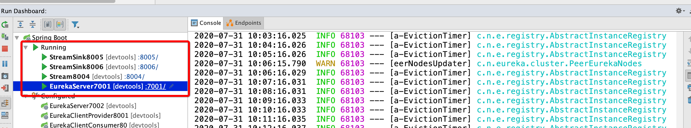
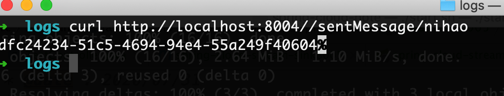
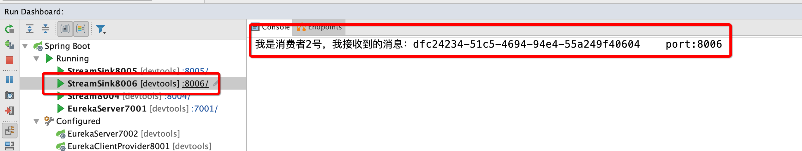
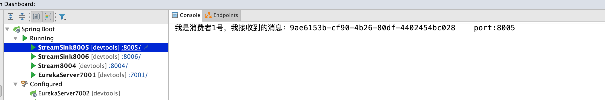

### 消息驱动(Spring Cloud Stream)

> 官网：
>
> https://spring.io/projects/spring-cloud-stream
>
> https://cloud.spring.io/spring-cloud-static/spring-cloud-stream/3.0.1.RELEASE/reference/html/

Spring Cloud Stream is a framework for building highly scalable event-driven microservices connected with shared messaging systems.

The framework provides a flexible programming model built on already established and familiar Spring idioms and best practices, including support for persistent pub/sub semantics, consumer groups, and stateful partitions.

> 一句话：屏蔽底层消息中间件的差异，降低切换成本，统一消息的切换模型。

自己的理解：Springcloud就像是hibernate或者mybatis一样，屏蔽掉底层的数据库的具体实现，它主要额的应用是：操作rabbitmq以及kafka的消息中间件的组件。让我们的工程师更加的专注于业务逻辑代码的编写。

### 一、角色的设定

消息的生产者 8004

消息的消费者 8005、8006

具体的业务实现，查看我们的具体的业务组件的代码的编写

### 二、高级特性

分组消费以及持久化，这是工作是工作中可以用到的部分。

> 面临的问题：
> 	重复消费的问题
> 	消息的持久化
> 	如何解决？
> 		使用消息分组来进行解决这样的问题
> 		如何是在不同的组，就会多次进行消费
> 		如果在同一个组，哪门该消息仅仅会消费一次
> 		所以我们要进行配置我们的服务是哪一个组的

分组消费
	配置分组的里面的基本的参数
		BindingProperties 这个类里面呢
	而且分组的小粉似乎也会采用某种的轮询算法的
	具体的配置查看我们的具体的业务代码

消息的持久化
	`默认分组不进行持久化，自定义分组回进行持久化`

### 三、编写代码进行测试

#### 3.1 消息提供者创建（发送者）

> 消息提供者实体消息的服务，我们利用这个服务进行发送我们想要发送的消息。

**新建消息发送者模块**

spring-cloud-stream-source8004

**pom.xml**

```xml
<?xml version="1.0" encoding="UTF-8"?>
<project xmlns="http://maven.apache.org/POM/4.0.0"
         xmlns:xsi="http://www.w3.org/2001/XMLSchema-instance"
         xsi:schemaLocation="http://maven.apache.org/POM/4.0.0 
         http://maven.apache.org/xsd/maven-4.0.0.xsd">
    <parent>
        <artifactId>spring-cloud-learn</artifactId>
        <groupId>com.breakpoint</groupId>
        <version>1.0-SNAPSHOT</version>
    </parent>
    <modelVersion>4.0.0</modelVersion>
    <packaging>jar</packaging>
    <artifactId>spring-cloud-stream-source8004</artifactId>
    <dependencies>
        <!--  配置 消息驱动的依赖   -->
        <dependency>
            <groupId>org.springframework.cloud</groupId>
            <artifactId>spring-cloud-starter-stream-rabbit</artifactId>
        </dependency>
        <!-- 以后所有的操作都是带有stater  -->
        <!--   netflix-eureka-client    -->
        <dependency>
            <groupId>org.springframework.cloud</groupId>
            <artifactId>spring-cloud-starter-netflix-eureka-client</artifactId>
        </dependency>
        <!--   引入spring-boot支持的依赖  -->
        <dependency>
            <groupId>org.springframework.boot</groupId>
            <artifactId>spring-boot-starter-web</artifactId>
        </dependency>
        <!--  注意一下 要引入 starter 的  -->
        <dependency>
            <groupId>org.springframework.boot</groupId>
            <artifactId>spring-boot-starter-actuator</artifactId>
        </dependency>
        <dependency>
            <groupId>org.springframework.boot</groupId>
            <artifactId>spring-boot-devtools</artifactId>
            <scope>runtime</scope>
            <optional>true</optional>
        </dependency>
        <dependency>
            <groupId>org.projectlombok</groupId>
            <artifactId>lombok</artifactId>
        </dependency>
        <dependency>
            <groupId>org.springframework.boot</groupId>
            <artifactId>spring-boot-starter-test</artifactId>
            <scope>test</scope>
        </dependency>
    </dependencies>
</project>
```

**application.yml**

```yaml
server:
  port: 8004 # 端口号
spring:
  application:
    name: cloud-stream-source
  rabbitmq:
    host: 127.0.0.1 # 地址的配置
    port: 5672
    username: guest
    password: guest
  cloud:
    stream:
      binders: # 在这里要绑定rabbit的基本的信息
        defaultRabbit: # 表示定义的名字 用于与binding进行整合
          type: rabbit
          environment:
            # 下面的配置与 直接配置是类似的
            spring:
              rabbitmq:
                host: 127.0.0.1 # 地址的配置
                port: 5672
                username: guest
                password: guest
      bindings:
        output:
          destination: studyExcehange # 表示用exchange的名称定义
          content-type: application/json
          binder: defaultRabbit # 设置绑定消息的具体的设置
# 服务注册中心的配置
eureka:
  client:
    service-url:
      defaultZone: http://peer1:7001/eureka/ # 服务的注册中心地址
    fetch-registry: true
    register-with-eureka: true
```

**启动类**

```java
/**
 * @author :breakpoint/赵立刚
 * @date : 2020/07/31
 */
@SpringBootApplication
@EnableDiscoveryClient
public class Stream8004 {
    public static void main(String[] args) {
        SpringApplication.run(Stream8004.class, args);
    }
}
```

**业务类**

```java
/**
 * @author :breakpoint/赵立刚
 * @date : 2020/07/31
 */
public interface IMessageProvider {

    String send(String message);
}
```


```java
/**
 * @author :breakpoint/赵立刚
 * @date : 2020/07/31
 */
@Slf4j
@EnableBinding({Source.class})
public class MessageProviderImpl implements IMessageProvider {

    @Resource
    private MessageChannel output;

    @Override
    public String send(String message) {
        String serial = UUID.randomUUID().toString();
        output.send(MessageBuilder.withPayload(serial).build());
        log.info("**************serial={}", serial);
        return serial;

    }
}
```


```java
/**
 * @author :breakpoint/赵立刚
 * @date : 2020/07/31
 */
@Slf4j
@RestController
public class TestController {

    @Autowired
    private IMessageProvider iMessageProvider;

    @GetMapping(value = "/sentMessage/{message}")
    public String sendMessage(@PathVariable("message") String message) {
        return iMessageProvider.send(message);
    }
}
```

至此，消息的发送者编码完毕！

#### 3.2 消息的消费者（消息接受者）

**spring-cloud-stream-sink8005**

**pom.xml**

```xml
<?xml version="1.0" encoding="UTF-8"?>
<project xmlns="http://maven.apache.org/POM/4.0.0"
         xmlns:xsi="http://www.w3.org/2001/XMLSchema-instance"
         xsi:schemaLocation="http://maven.apache.org/POM/4.0.0 
         http://maven.apache.org/xsd/maven-4.0.0.xsd">
    <parent>
        <artifactId>spring-cloud-learn</artifactId>
        <groupId>com.breakpoint</groupId>
        <version>1.0-SNAPSHOT</version>
    </parent>
    <modelVersion>4.0.0</modelVersion>
    <packaging>jar</packaging>
    <artifactId>spring-cloud-stream-sink8005</artifactId>
    <dependencies>
        <!--  配置 消息驱动的依赖   -->
        <dependency>
            <groupId>org.springframework.cloud</groupId>
            <artifactId>spring-cloud-starter-stream-rabbit</artifactId>
        </dependency>
        <!-- 以后所有的操作都是带有stater  -->
        <!--   netflix-eureka-client    -->
        <dependency>
            <groupId>org.springframework.cloud</groupId>
            <artifactId>spring-cloud-starter-netflix-eureka-client</artifactId>
        </dependency>
        <!--   引入spring-boot支持的依赖  -->
        <dependency>
            <groupId>org.springframework.boot</groupId>
            <artifactId>spring-boot-starter-web</artifactId>
        </dependency>
        <!--  注意一下 要引入 starter 的  -->
        <dependency>
            <groupId>org.springframework.boot</groupId>
            <artifactId>spring-boot-starter-actuator</artifactId>
        </dependency>
        <dependency>
            <groupId>org.springframework.boot</groupId>
            <artifactId>spring-boot-devtools</artifactId>
            <scope>runtime</scope>
            <optional>true</optional>
        </dependency>
        <dependency>
            <groupId>org.projectlombok</groupId>
            <artifactId>lombok</artifactId>
        </dependency>
        <dependency>
            <groupId>org.springframework.boot</groupId>
            <artifactId>spring-boot-starter-test</artifactId>
            <scope>test</scope>
        </dependency>
    </dependencies>
</project>
```

**application.yml**

```yaml
server:
  port: 8005
spring:
  application:
    name: cloud-stream-sink
  rabbitmq:
    host: 127.0.0.1
    port: 5672
    username: guest
    password: guest
  cloud:
    stream:
      binders:
        defaultRabbitMq:
          type: rabbit
          environment:
            # 下面的配置与 直接配置是类似的
            spring:
              rabbitmq:
               host: 127.0.0.1 # 地址的配置
               port: 5672
               username: guest
               password: guest
      bindings:
        input:
          destination: studyExcehange # 表示用exchange的名称定义
          content-type: application/json
          binder: defaultRabbitMq # 设置绑定消息的具体的设置
          # 配置组 ，相同的组的消息仅仅可以消费一次
          group: group_A
eureka:
  client:
    service-url:
      defaultZone: http://peer1:7001/eureka/ # 服务的注册中心地址
    fetch-registry: true
    register-with-eureka: true
```

**SinkService**

```java
/**
 * @author :breakpoint/赵立刚
 * @date : 2020/07/31
 */
@EnableBinding({Sink.class})
public class SinkService {

    @Value("${server.port}")
    private String serverPort;

    @StreamListener(Sink.INPUT)
    public void input(Message<String> message) {
        System.out.println("我是消费者1号，我接收到的消息：" + message.getPayload() + "\t port:" + serverPort);
    }

}
```

**StreamSink8005**

```java
/**
 * @author :breakpoint/赵立刚
 * @date : 2020/07/31
 */
@SpringBootApplication
@EnableDiscoveryClient
public class StreamSink8005 {
    public static void main(String[] args) {
        SpringApplication.run(StreamSink8005.class, args);
    }
}
```

> 一个消费者创建完毕，另一个相同的步骤，创建我们的消息的接收者。

#### 3.3 运行测试

分别启动 服务注册中心以及3个微服务



测试：curl http://localhost:8004//sentMessage/nihao



日志打印：







> 我们请求发现，消息的接受者可以接收到我们的消息，而且，消息仅仅有一个消息接受者进行消费，这是因为，我们配置了相同的分组：
>
> ```yaml
> bindings:
>   input:
>     destination: studyExcehange # 表示用exchange的名称定义
>     content-type: application/json
>     binder: defaultRabbitMq # 设置绑定消息的具体的设置
>     # 配置了相同的分组
>     group: group_A
> ```

代码小结：https://github.com/zhaoligang594/spring-cloud-learn/releases/tag/11.0.0

----

**{docsify-updated}** 